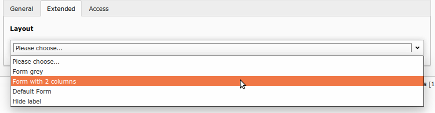

# FAQ

## How to migrate to powermail 8.0.0?

Just execute the both upgrade wizard steps regarding to powermail

## How to use responsive columns in powermail?

Since powermail 4.0 it's possible to use wrapping containers for (e.g.) every 2/3/4 fields to get a markup like
you already may know from bootstrap:

```
<div class="row">
    <div class="form-group col-md-6">
        <label>Firstname</label>
        <input type="text" ... />
    </div>
    <div class="form-group col-md-6">
        <label>Lastname</label>
        <input type="text" ... />
    </div>
</div>
<div class="row">
    <div class="form-group col-md-6">
        <label>Email</label>
        <input type="text" ... />
    </div>
    <div class="form-group col-md-6">
        <label>Phone</label>
        <input type="text" ... />
    </div>
</div>
```

Have a look into static TypoScript template BootstrapClassesAndLayout for some bootstrap classes examples.
Example TypoScript configuration:

```
plugin.tx_powermail.settings.setup {
    styles {
        numberOfColumns = 2
        framework {
            rowClasses = row
            fieldAndLabelWrappingClasses = form-group col-md-6
        }
    }
}
```

How does the magic work? There is a viewhelper in Page.html partial, that adds containers after x fields:

```
<vh:misc.createRowTags
    columns="{settings.styles.numberOfColumns}"
    class="{settings.styles.framework.rowClasses}"
    iteration="{iteration}"
    additionalAttributes="{data-foo:'bar'}
    tagName="div">

    <f:render partial="Field ..." />
</vh:misc.createRowTags>
```

columns:              Number of columns - 0 disables creation of new containers completely
class:                Class name(s) for the new tag
iteration:            The iteration array from a foreach viewhelper
additionalAttributes: Any additional attributes for the new tags (must be type of array)
tagName:              Tagname for the new containers ("div" if not given)


## How to solve SPF defiance?

More and more email providers turn on SPF for their mailboxes
(see https://en.wikipedia.org/wiki/Sender_Policy_Framework for details).
Web forms should not send mails with the visitors email address as sender email address but with a server email address.
Nevertheless powermail uses automatic reply email address from the sender.

To set a sender email address for the main email (to receiver), you could use this TypoScript:

```
plugin.tx_powermail.settings.setup.receiver.overwrite.senderEmail = TEXT
plugin.tx_powermail.settings.setup.receiver.overwrite.senderEmail.value = server@domain.org
plugin.tx_powermail.settings.setup.receiver.overwrite.senderName = TEXT
plugin.tx_powermail.settings.setup.receiver.overwrite.senderName.value = Server from domain.org
```

To set a sender email address for the confirmation email (to sender), you could use this TypoScript:

```
plugin.tx_powermail.settings.setup.sender.overwrite.senderEmail = TEXT
plugin.tx_powermail.settings.setup.sender.overwrite.senderEmail.value = server@domain.org
plugin.tx_powermail.settings.setup.sender.overwrite.senderName = TEXT
plugin.tx_powermail.settings.setup.sender.overwrite.senderName.value = Server from domain.org
```

To set a sender email address for the double-opt-in confirmation email (to sender), you could use this TypoScript:

```
plugin.tx_powermail.settings.setup.optin.overwrite.senderEmail = TEXT
plugin.tx_powermail.settings.setup.optin.overwrite.senderEmail.value = server@domain.org
plugin.tx_powermail.settings.setup.optin.overwrite.senderName = TEXT
plugin.tx_powermail.settings.setup.optin.overwrite.senderName.value = Server from domain.org
```

Please ask your server administrator for a valid email address.


## Failure, mail could not be sent! What does this mean?

If a mail could not be sent this message is coming up. You can turn on logs to see what's happening here (look at
the documentation part for logging and debugging)


## Can I attach files to any mail?

Yes. You can simply add some files to any mail via TypoScript cObject – see TypoScript Main Template for details.

Short example:

```
plugin.tx_powermail.settings.setup.sender {
    addAttachment = TEXT
    addAttachment.value = fileadmin/file.pdf
}
```

## How to change the style selector with my own values (In Forms, Pages or Fields)?

```
<select>
    <option value=”layout1”>Layout1</option>
    <option value=”layout2”>Layout2</option>
    <option value=”layout3”>Layout3</option>
</select>
```


Changing values via page tsconfig:

```
TCEFORM {
    tx_powermail_domain_model_form {
        css {
            removeItems = layout1, layout2, layout3
            addItems {
                formgrey = Form grey
                form2cols = Form with 2 columns
                default = Default Form
            }
        }
    }
    tx_powermail_domain_model_page < .tx_powermail_domain_model_form
    tx_powermail_domain_model_field < .tx_powermail_domain_model_form
}
```

This configuration produces this output in backend:

```
<select>
    <option value=”formgrey”>Form grey</option>
    <option value=”form2cols”>Form with 2 columns</option>
    <option value=”default”>Default Form</option>
</select>
```

And adds the class “formgrey”, "form2cols" or “default” to all forms, pages and fields in the frontend.




## How to hide fields for editors?

### Hiding fields in tables form, page or field

For editors (not administrators) fields can be disabled in the rights management of TYPO3
(see TYPO3 documentation how to show or hide fields for editors).

Another way is to hide fields for editors (and administrators) via Page TSConfig:

```
TCEFORM {
    tx_powermail_domain_model_form {
        css.disabled = 1
    }
    tx_powermail_domain_model_page {
        css.disabled = 1
    }
    tx_powermail_domain_model_field {
        css.disabled = 1
        feuser_value.disabled = 1
        placeholder.disabled = 1
    }
}
```

You may also restrict this and other settings to non-admin users with a TypoScript
condition (see https://docs.typo3.org/typo3cms/TSconfigReference/Conditions/Index.html).

### Hiding fields from FlexForm

If you add a powermail plugin, you will see some options in FlexForm. If you want to hide some of these
fields (for editors and administrators), you can also do it via Page TSConfig:

```
TCEFORM {
    tt_content {
        pi_flexform {
            powermail_pi1 {
                main {
                    settings\.flexform\.main\.moresteps.disabled = 1
                    settings\.flexform\.main\.optin.disabled = 1
                    settings\.flexform\.main\.confirmation.disabled = 1
                    settings\.flexform\.main\.pid.disabled = 1
                }

                receiver {
                    settings\.flexform\.receiver\.fe_group.disabled = 1
                }

                thx {
                    settings\.flexform\.thx\.redirect.disabled = 1
                }
            }
        }
    }
}
```

## How to hide field types?

If you want to completely remove fieldtypes (e.g. if you do not need a captcha field or other types),
you can do this with a simple line of Page TSConfig:

`TCEFORM.tx_powermail_domain_model_field.type.removeItems = captcha,location,typoscript`


# I want to use additionalAttributes in a field partial, but it's already in use

All Field partials are original stored under EXT:powermail/Resources/Private/Partials/Form/Field/*
Most of them are already using the parameter additionalAttributes to set data-attributes for clientside validation, etc...
In some case you need to set your own additionalAttributes - see following code examples.

```
<!-- Original textfield example -->
<f:form.textfield
    ...
    additionalAttributes="{vh:validation.validationDataAttribute(field:field)}"
    ... />

<!-- Modified textfield example -->
<f:form.textfield
    ...
    additionalAttributes="{vh:validation.validationDataAttribute(field:field, additionalAttributes:'{autocomplete:\'off\',data-something:\'true\'}')}"
    ... />
```


## I want to use powermail on a news-detail-page, but the error **Reason: No news entry found.** comes up

If you want to send a newstitle or something with powermail on a newsdetailpage, a form submit leads
to a pagereload. But per default, powermail does not send the params `&tx_news_pi1[news]` again which
leads to an error from the extension news.

This is easy to handle, just add this line of TypoScript to your **Constants**:

`plugin.tx_powermail.settings.misc.addQueryString = 1`


## I have a problem, what can I do?

- Did you read the manual?
- Turning on the Debug Output in Powermail (via TypoScript) can help you to find a solution (please use extension devlog to look into the debug arrays)
- Try to get free help from the slack channel https://typo3.slack.com/messages/ext-powermail/
- Try to get free help from a TYPO3 Forum like (forum.typo3.org, typo3.net or typo3forum.net)
- Do you need paid support? Please write to http://www.in2code.de
- Did you find a bug? Report it to https://github.com/einpraegsam/powermail/issues
- Did you miss a feature? Feel free to write it down on https://github.com/einpraegsam/powermail/issues
