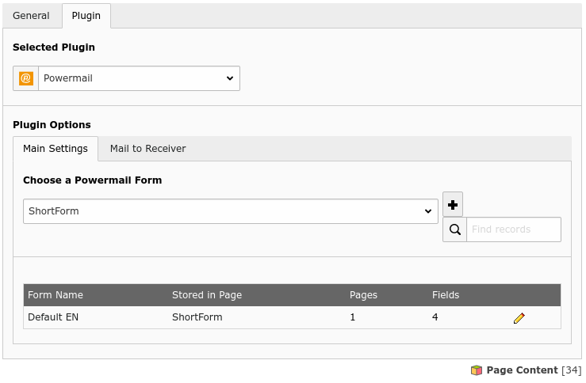
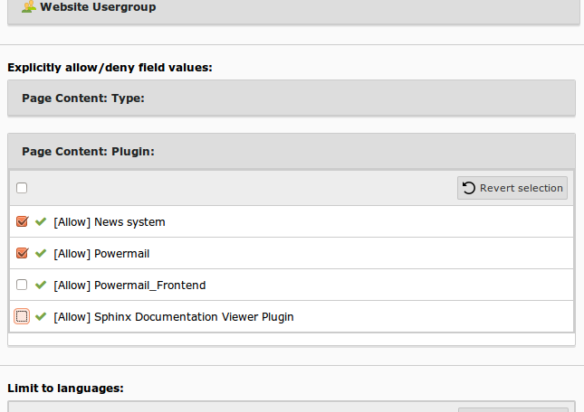
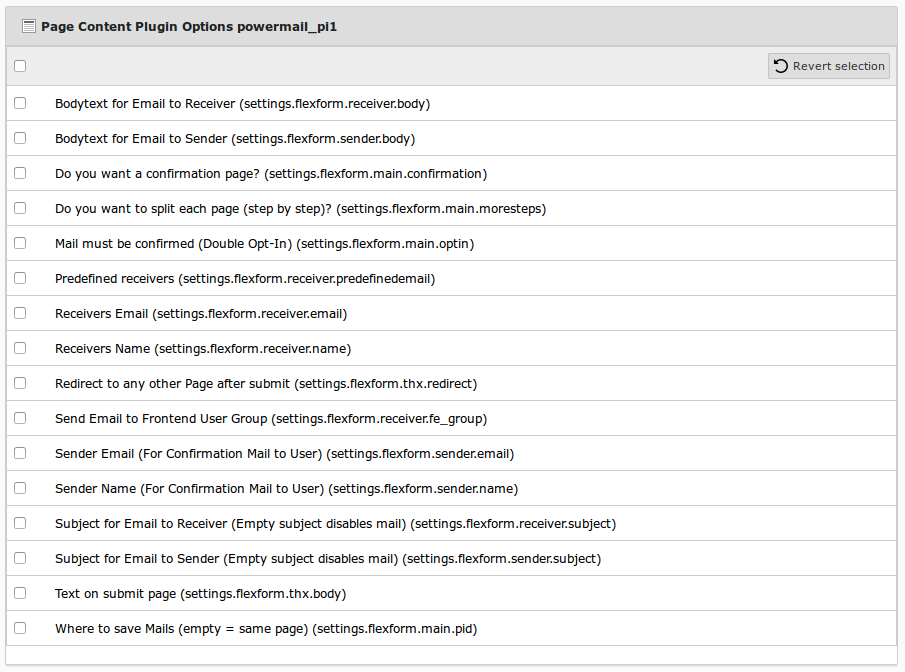

# Backend User Rights

## Introduction

A backend user without administration rights is not able to manage all fields in a powermail form by default.
Maybe the Plugin looks like:

## Solution

The user is not able to see the powermail fields. The problem is simple to solve.
The admin should have a look into "Page Content: Plugin" and after that into
"Page Content Plugin Options powermail_pi1" in the user or usergroup record.

After having all access rights, the plugin will look like:

