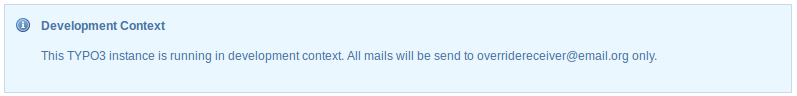
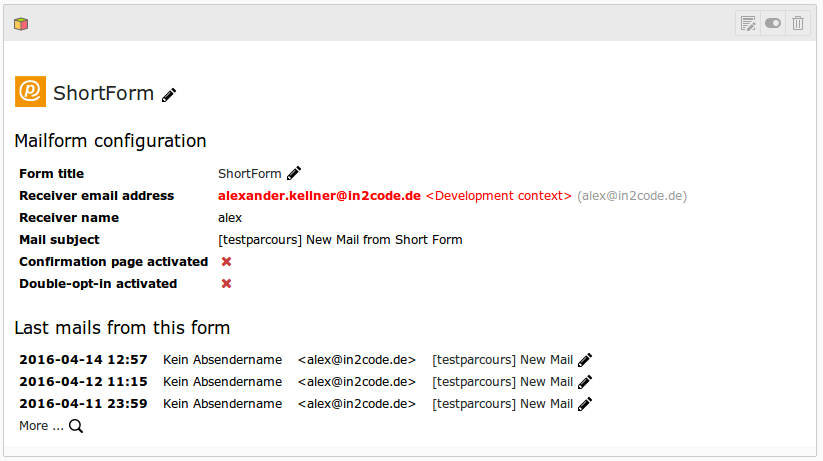

# Development Context

It could be usefull to set a test receiver email for all powermail forms in one TYPO3 instance.

Together with the context mode (introduced in TYPO3 6.2) you can test your forms on your development environment
and deploy it to a production server without making changes in the database.

## Activate Development Context

You can activate the development context in your apache settings - e.g.:

```
<VirtualHost *:80>

    ...

    SetEnv TYPO3_CONTEXT Development
</VirtualHost>
```

Or on your .htaccess - e.g.:

```
...
RewriteEngine On

# Enable TYPO3 development context for domain local.org
RewriteCond %{HTTP_HOST} ^local\.org$
RewriteRule (.*) $1 [E=TYPO3_CONTEXT:Development]

RewriteBase /
...
```


## Set Override-Email for Context

Add a line to your AdditionalConfiguration.php - e.g.:

`$GLOBALS['TYPO3_CONF_VARS']['EXT']['powermailDevelopContextEmail'] = 'overridereceiver@email.org';`

This email is only active, if TYPO3 runs in Development Context!

## Images

### Backend Module Function Check




### Plugin Information with note


