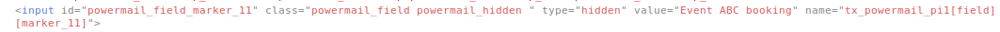
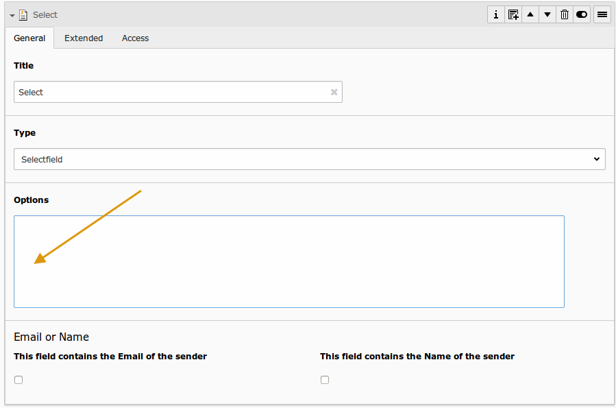
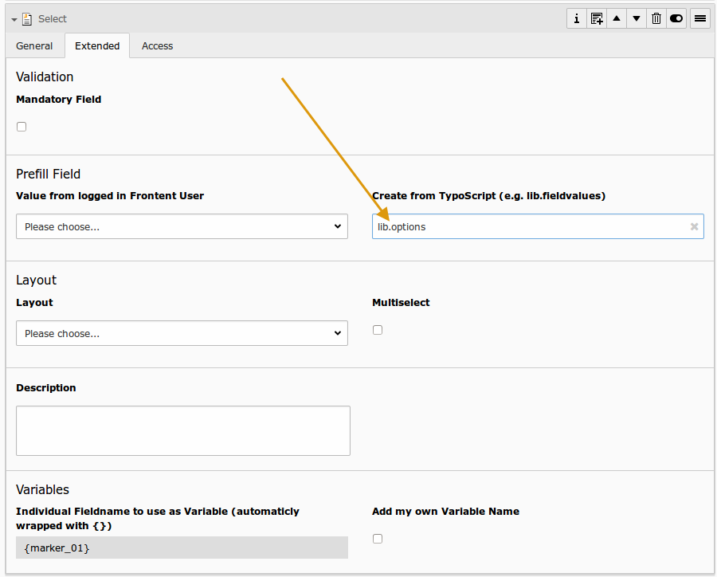

# Prefill or preselect a field

## The standard way

Prefilling (input, textarea, hidden) or preselecting (select, check, radio)
of fields will be done by the PrefillFieldViewHelper. It
listen to the following methods and parameters (in this ordering):

### 1. GET/POST param like `&tx_powermail_pi1[field][marker]=value`

**NOTE:** If you want to a get parameter to prefill a form field, you need to exclude this parameter
in `[FE][cacheHash][excludedParameters]`, otherwise you will create 404 request, if `[FE][pageNotFoundOnCHashError]`
is enabled (what should be enabled for security reasons!)

Example part in the LocalConfiguration.php:

```
'FE' => [
    'cacheHash' => [
        'excludedParameters' => [
            'L',
            'utm_source',
            'utm_medium',
            'utm_campaign',
            'utm_term',
            'utm_content',
            'tx_powermail_pi1[field][marker]',
        ]
    ]
],
```

### 2. If field should be filled with values from FE_User (see field configuration)

### 3. If field should be prefilled from static Setting (see field configuration)

### 4. Fill with TypoScript cObject like

```
plugin.tx_powermail.settings.setup.prefill {
    # Fill field with marker {email}
    email = TEXT
    email.value = mail@domain.org
}
```

### 5. Fill with simple TypoScript like

```
plugin.tx_powermail.settings.setup.prefill {
    # Fill field with marker {email}
    email = mail@domain.org
}
```

### 6. Fill with your own PHP with a Signal.

Look at In2code\Powermail\ViewHelpers\Misc\PrefillFieldViewHelper::render()


### Example markup




## Generating select options out of TypoScript

You can dynamicly generate a select (or radio-buttons or checkboxes) field in powermail with some lines of TypoScript.
To use this feature, you have to leave the field "Options" empty and you should fill the field
"Create from TypoScript" with a TypoScriptObjectPath. See the following example:






### Example 1

After this, you can define your TypoScript setup:

```
lib.options = TEXT
lib.options.value = red[\n]blue[\n]pink
```

This will result in a HTML like:

```
<select ...>
    <option>red</option>
    <option>blue</option>
    <option>pink</option>
</select>
```


### Example 2

You can also define it with different labels and values:

```
lib.options = TEXT
lib.options.value = Red shoes|red[\n]Blue shoes|blue|*[\n]Pink shoes|pink
```

This will result in a HTML like:

```
<select ...>
    <option value="red">Red shoes</option>
    <option value="blue" selected="selected">Blue shoes</option>
    <option value="pink">Pink shoes</option>
</select>
```


### Example 3

Or maybe the visitor should select a category from table sys_category:

```
lib.options = CONTENT
   lib.options {
       table = sys_category
       select.pidInList = 156
       renderObj = COA
       renderObj {
           10 = TEXT
           10.field = title

           20 = TEXT
           20.value = |

           30 = TEXT
           30.field = uid

           stdWrap.wrap = |[\n]
       }
   }
```

This will result in a HTML like:

```
<select ...>
    <option value="23">Category 1</option>
    <option value="24">Category 1</option>
    <option value="25">Category 1</option>
</select>
```
