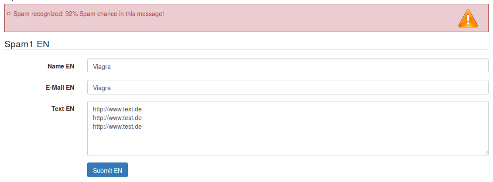
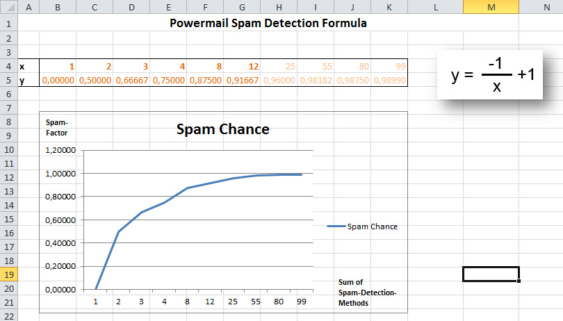

# Spam Prevention

## Spamcheck in powermail

### Introduction



Spamshield is a method to protect your mailforms from spam without the usage of a captcha field.
After a submit, different spammethods must be passed:

- Honeypot
- Linkcheck
- Namecheck
- Sessioncheck
- UniqueValues
- String Blacklist
- IP-Address Blacklist

Every submitted form will be checked with this methods. Every failed
method adds a Spam-Indication-Number to a storage. The sum of the
Spam-Indication-Numbers leads to a Spam-Factor (from 0 to 100%). Per
default every mail with a Spam-Factor of 75% is declined with a
message.


### How is a Spam-Number related to the Spam-Factor?



In this example leads a Spam-Indication from 4 to a 75% chance of spam
in the mail(3: 66%, 12: 92%, etc...)


### Configuration via TypoScript

```
plugin.tx_powermail {
    settings.setup {
        spamshield {
            _enable = 1
            factor = 75
            email = administrator@domain.org
            emailSubject = Spam in powermail form recognized
            emailTemplate = EXT:powermail/Resources/Private/Templates/Mail/SpamNotification.html
            logfileLocation = typo3temp/logs/powermail_spam.log
            logTemplate = EXT:powermail/Resources/Private/Templates/Log/SpamNotification.html

            methods {
                # Honeypot check
                1 {
                    _enable = 1

                    # Spamcheck name
                    name = Honey Pot

                    # Class
                    class = In2code\Powermail\Domain\Validator\SpamShield\HoneyPodMethod

                    # if this check failes - add this indication value to indicator (0 disables this check completely)
                    indication = 5

                    # method configuration
                    configuration {
                    }
                }

                # Link check
                2 {
                    _enable = 1

                    # Spamcheck name
                    name = Link check

                    # Class
                    class = In2code\Powermail\Domain\Validator\SpamShield\LinkMethod

                    # if this check failes - add this indication value to indicator (0 disables this check completely)
                    indication = 3

                    # method configuration
                    configuration {
                        # number of allowed links
                        linkLimit = 2
                    }
                }

                # Name check
                3 {
                    _enable = 1

                    # Spamcheck name
                    name = Name check

                    # Class
                    class = In2code\Powermail\Domain\Validator\SpamShield\NameMethod

                    # if this check failes - add this indication value to indicator (0 disables this check completely)
                    indication = 3

                    # method configuration
                    configuration {
                    }
                }

                # Session check
                4 {
                    _enable = 1

                    # Spamcheck name
                    name = Session check

                    # Class
                    class = In2code\Powermail\Domain\Validator\SpamShield\SessionMethod

                    # if this check failes - add this indication value to indicator (0 disables this check completely)
                    indication = 5

                    # method configuration
                    configuration {
                    }
                }

                # Unique check
                5 {
                    _enable = 1

                    # Spamcheck name
                    name = Unique check

                    # Class
                    class = In2code\Powermail\Domain\Validator\SpamShield\UniqueMethod

                    # if this check failes - add this indication value to indicator (0 disables this check completely)
                    indication = 2

                    # method configuration
                    configuration {
                    }
                }

                # Value blacklist check
                6 {
                    _enable = 1

                    # Spamcheck name
                    name = Value blacklist check

                    # Class
                    class = In2code\Powermail\Domain\Validator\SpamShield\ValueBlacklistMethod

                    # if this check failes - add this indication value to indicator (0 disables this check completely)
                    indication = 7

                    # method configuration
                    configuration {
                        # Blacklisted values (could also get read from a file - simply with FLUIDTEMPLATE)
                        values = TEXT
                        values.value = viagra,sex,porn,p0rn
                    }
                }

                # IP blacklist check
                7 {
                    _enable = 1

                    # Spamcheck name
                    name = IP blacklist check

                    # Class
                    class = In2code\Powermail\Domain\Validator\SpamShield\IpBlacklistMethod

                    # if this check failes - add this indication value to indicator (0 disables this check completely)
                    indication = 7

                    # method configuration
                    configuration {
                        # Blacklisted values (could also get read from a file - simply with FLUIDTEMPLATE)
                        values = TEXT
                        values.value = 123.132.125.123,123.132.125.124
                    }
                }
            }
        }
    }
}
```

### Debug and finetune the Spamsettings

It is useful to activate a notify mail to the admin (for an initial time period e.g.) if a submit failed
(see TypoScript above how to enable). In the mail, you see which checks failed and the overall Spam Factor.
This is an example of the mail content:

```
Possible spam in powermail form on page with PID 3

Spamfactor of this mail: 92%


Failed Spamchecks:
0: nameCheck failed
1: uniqueCheck failed
2: blacklistStringCheck failed


Given Form variables:
2: Alex
9: Alex
10: alexander.kellner@in2code.de
3: Viagra and Free P0rn
See link on http://freeporn.de or http://freeporn.com

Senders IP address: 155.233.10.8
```

As an alternative, you can enable a logfile (see TypoScript above how to enable),
where all spam is logged. This is an example content of the logfile:

```
----------------------------------------------------

2015-10-19 12:03:39

PID: 184
Spamfactor of this mail: 92%
Failed Spamchecks:
- linkCheck failed
- uniqueCheck failed
- blacklistStringCheck failed

Given Form variables:
- Name: Viagra
- E-Mail: Viagra
- Text: http://www.test.de
http://www.test.de
http://www.test.de

Senders IP addess: 127.0.0.1
```

You can also enable the Spamshield Debug (what means to log failure) to see the Methods which are failed above the form.
Enable with TypoScript setup:

`plugin.tx_powermail.settings.setup.debug.spamshield = 1`

See https://docs.typo3.org/m/typo3/reference-coreapi/master/en-us/ApiOverview/Logging/Index.html how to see how
logging can be used in TYPO3.


### Register own spamcheck methods

Of course you can register own spamshield methods. See manual part "for developers" for examples.


### Disable spamcheck on some condition

Of course you can disable all spamshield methods on some conditions. See manual part "for developers" for examples.


## Captcha

Using a captcha extension also helps to prevent spam. You can simply add a new field of type captcha.
A build-in calculating captcha will be shown in frontend.
If you want to use another extension, you can install the extension "captcha" from TER and configure powermail
to use this extension for every captcha:

`plugin.tx_powermail.settings.setup.captcha.use = captcha`
