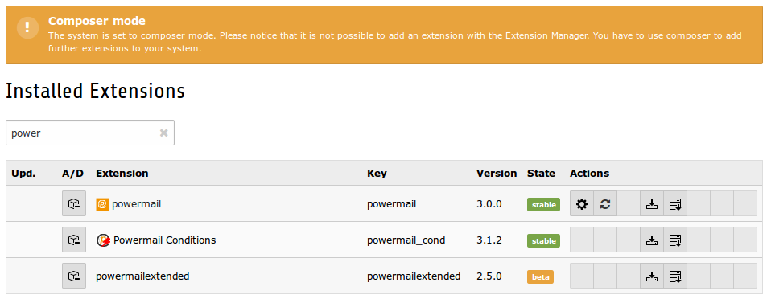
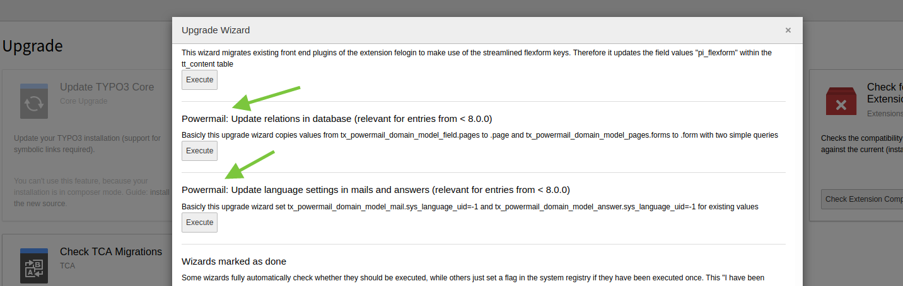
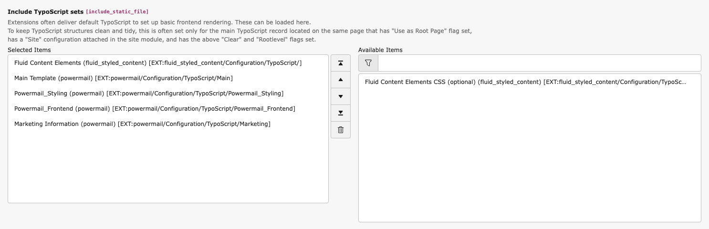

# Installation

## Import for installation

Just require this extension via composer

`composer require in2code/powermail`


## Activate

Install the extension and follow the instructions in TYPO3.



**Note:** If you update your powermail extension to version 8.0.0 (or higher) from a version under 8, you have
to execute the upgrade wizard. Two steps are added from powermail 8.0.0

* Copy values from tx_powermail_domain_model_field.pages to .page and from tx_powermail_domain_model_page.forms to .form
* Set sys_language_uid to -1 for tx_powermail_domain_model_mail and tx_powermail_domain_model_answer



## Extension Manager Settings

Main configuration for powermail for CMS wide settings.

| Field | Description | Default value |
|-------|-------------|---------------|
| Disable IP logging | If you generally don't want to save the sender IP address in the database, you can use this checkbox. | 1 |
| Disable marketing information | If you want to disable all marketing relevant information of powermail, you can enable this checkbox (effected: mail to admin, backend module, mail records, no static typoscript template). | 0 |
| Disable BE module | You can disable the backend module if you don't store mails in your database or if you don't need the module. | 0 |
| Disable plugin information | Below every powermail plugin is a short info table with form settings. You can disable these information. | 0 |
| Disable plugin information mail preview | The plugin information shows 3 latest mails. If you want to disable this preview, you can check the button. | 0 |
| Enable Form caching | With this setting, you can enable the caching of the form generation, what speeds up sites with powermail forms in the frontend. On the other hand, some additional features (like prefilling values from GET paramter, etc...) are not working any more. | 0 |
| Enable Merge for l10n_mode | All fields with l10n_mode exclude should change their translation behaviour to mergeIfNotBlank. This allows you to have different field values in different languages. | 0 |
| ElementBrowser replaces IRRE | Editors can add pages within a form table via IRRE. If this checkbox is enabled, an element browser replaces the IRRE Relation. Note: this is a beta-feature and not completely tested! | 0 |

## Static Templates

Add powermail static templates for full functions



| Field | Description |
| Main template (powermail) | Main functions and settings for all powermail forms. |
| Powermail_Frontend (powermail) | If you want to use show mails in frontend (Pi2), choose this template. |
| Add classes and CSS based on bootstrap (powermail) | If you want to add default bootstrap classes to all forms, pages and fields in frontend, you should add this static template. Note: If you want to add bootstrap.css from powermail, see constant editor. |
| Marketing Information (powermail) | If you want to see some marketing information about your visitors, you have to add this Template to your root Template. An AJAX function (needs jQuery) sends basic information to a powermail script (Visitors Country, Page Funnel, etc...). |

**Note** TypoScript can be modified to configure powermail in the way you want to use powermail.
See BestPractice/MainTypoScript for an overview over the complete TypoScript.

## Add Bootstrap classes and CSS to powermail

First of all you should add the static template **Add classes and CSS based on bootstrap (powermail)**
Now, forms and fields should get default bootstrap css classes in Frontend. In addition you have to add
bootstrap.css by your own or with following constants:

`plugin.tx_powermail.settings.styles.bootstrap.addBootstrap = 1`

You can change the default classes with the constants editor.
The full TypoScript constants of the static template:

```
plugin.tx_powermail {
	settings {
		BasicCss = EXT:powermail/Resources/Public/Css/Basic.css

		styles {
			bootstrap {
				# cat=powermail_styles//0000; type=boolean; label= Enable loading of bootstrap.min.css from powermail
				addBootstrap = 0

				# cat=powermail_styles//0010; type=text; label= Define path Bootsrap.css
				bootstrapPath = EXT:powermail/Resources/Public/Css/Bootstrap.css

				# cat=powermail_styles//0020; type=int+; label= Number of columns
				numberOfColumns = 2


				# cat=powermail_styles//0100; type=text; label= Framework classname(s) for row containers
				rowClasses = row

				# cat=powermail_styles//0105; type=text; label= Framework classname(s) for form "form-horizontal"
				formClasses = form-horizontal

				# cat=powermail_styles//0110; type=text; label= Framework classname(s) for overall wrapping container of a field/label pair e.g. "row form-group"
				fieldAndLabelWrappingClasses = form-group col-md-6

				# cat=powermail_styles//0120; type=text; label= Framework classname(s) for wrapping container of a field e.g. "row form-group"
				fieldWrappingClasses = col-sm-10

				# cat=powermail_styles//0130; type=text; label= Framework classname(s) for fieldlabels e.g. "col-md-2 col-md-3"
				labelClasses = control-label col-sm-2

				# cat=powermail_styles//0140; type=text; label= Framework classname(s) for fields e.g. "form-control"
				fieldClasses = form-control

				# cat=powermail_styles//0150; type=text; label= Framework classname(s) for fields with an offset e.g. "col-sm-offset-2"
				offsetClasses = col-sm-offset-2

				# cat=powermail_styles//0160; type=text; label= Framework classname(s) especially for radiobuttons e.g. "radio"
				radioClasses = radio

				# cat=powermail_styles//0170; type=text; label= Framework classname(s) especially for checkboxes e.g. "check"
				checkClasses = checkbox

				# cat=powermail_styles//0180; type=text; label= Framework classname(s) for the submit button e.g. "btn btn-primary"
				submitClasses = btn btn-primary

				# cat=powermail_styles//0190; type=text; label= Framework classname(s) for "create" message after submit
				createClasses = powermail_create

				# if this constant is set, constants {$plugin.tx_powermail.settings.styles.bootstrap.*} overrides {$plugin.tx_powermail.settings.styles.framework.*}
				important = 1
			}
		}
	}
}
```
