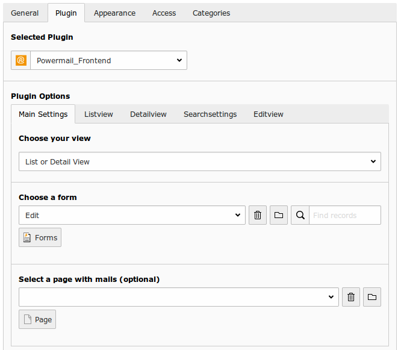

# Powermail_Frontend

## Introduction

powermail_frontend gives you the possibility to show the stored mails
again in the frontend. With this additional plugin (Pi2), it's possible to create
a small guestbook or database listing. In addition some export methods
are included (XLS, CSV, RSS) or logged in FE\_Users can change the
values again.

## Plugin Settings

| Field | Description | Explanation | Tab |
|-------|-------------|-------------|-----|
| Choose your view | Choose a view | List or Detail, Edit, All Views | Main Settings |
| Choose a form | Choose an existing form | Select a Form and click save | Main Settings |
| Select a page with mails | Select a page with mails (optionsl) | Only mails which are stored in the given page are shown in the frontend (optional setting). | Main Settings |
| Choose Fields | Choose Fields (Empty: All Fields) | Let the selection empty if you want to see all form values. | Listview |
| Export Formats | Add links to different export methods by adding some. | XLS, CSV or RSS feed is possible in powermail_frontend. | Listview |
| Show entries... | If you want to show only mails within a timeperiod, add some seconds. | If you want to show the mails of the last 24h add “86400”. Let this field empty to disable this function. | Listview |
| Show max. X entries... | Limit for mail output. | Add a number if you want to show only X entries. | Listview |
| Page with Plugin for list view... | Select the page with the list plugin. | This is needed if the plugin shows the edit or single view and it should link you back to the list view. Let this field empty means list view is on current page. | Listview |
| Own entries | Show only my mails. | Show only the mails that where submitted by the current logged in FE_User in the list view. | Listview |
| Choose Fields to show | What field should be listed in the detail view? | Let the selector empty if you want to see all form values. | Detailview |
| Page with Plugin for detail view | Select the page with the detail plugin. | This is needed if the plugin shows the list view and it should link you to the detail view. Let this field empty means detail view is on current page. | Detailview |
| Add searchfield | Add some search fields above the list. | Select a single field or choose `[Fulltext Search]` for an overall search | Searchsettings |
| Add ABC filter | Add ABC filter list in frontend. | Select a field with a leading letter to filter for it. Firstname means: When a user clicks on A, all mails with a beginning A in the firstname are shown (Alex, Andreas, Agnes, etc...) | Searchsettings |
| Choose Fields to edit | What fields should be editable? | Let the selector empty if you want to edit all fields. | Editview |
| Choose one or more Frontend-Users with permissions to change | Choose a frontend user who is able to edit a mail. | Value can be one or more static FE\_Users or the Creator of a mail `[Owner]`. You can select a group in addition (see next row). | Editview |
| Choose one or more Frontend-Groups with permissions to change | Choose frontend users of a group which are able to edit a mail. | Value can be one or more static FE\_User Groups or the Creator Group of a mail [Owner]. You can select some single FE_Users in addition (see row before). | Editview |
| Page with Plugin for edit view | Select the page with the edit plugin. | This is needed if the plugin shows the list view and it should link you to the edit view. Let this field empty means edit view is on current page. | Editview |
