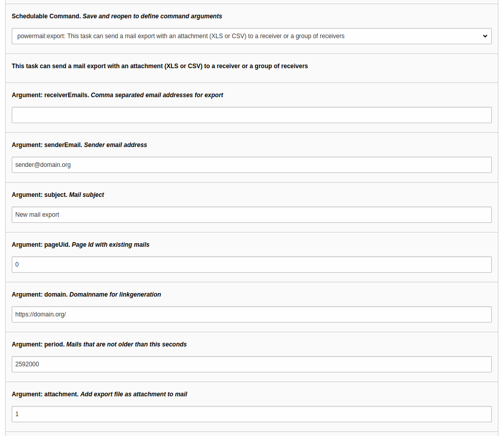
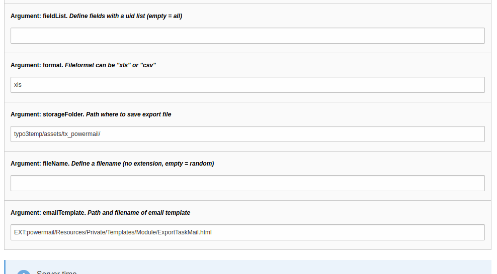
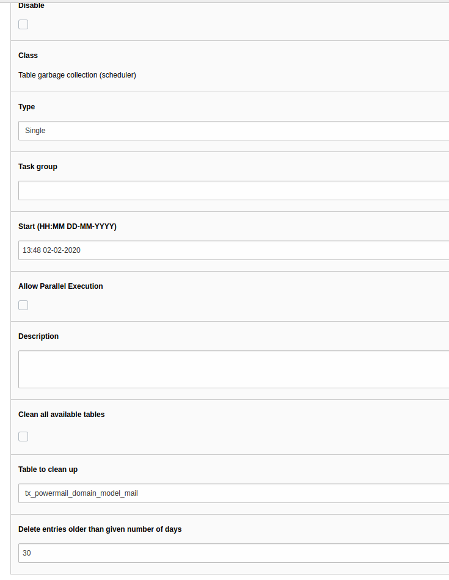
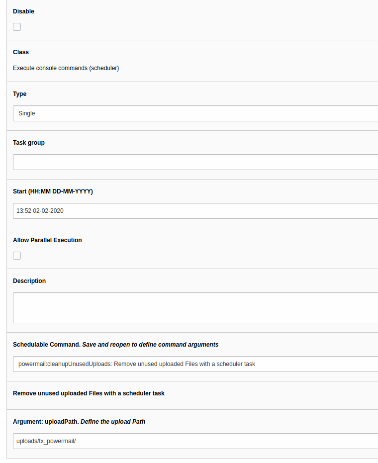
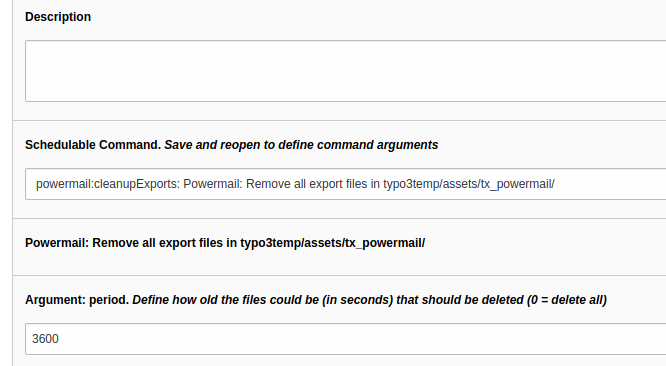
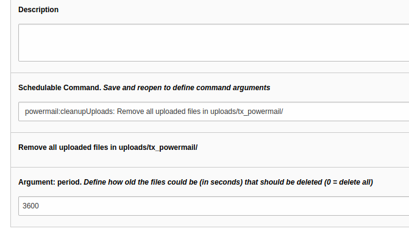
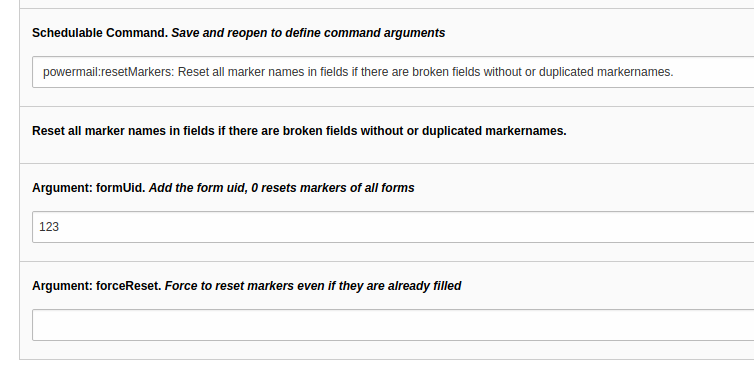

# Scheduler tasks and symfony commands in powermail

## 1. ExportCommand

### Introduction

Generate a mail with an export file from saved mails as attachment

You can generate mails with a link to an exportfile or simply attach an export file to this mail.
With this task you can (e.g.) send yourself 1 time a day a mail with all mails from the last 24h.

### Configuration

| Propertyname | Description | Default value |
|--------------|-------------|---------------|
| receiverEmails | Add one or more (comma-separated) recevier email addresses for mail generation | [required] |
| senderEmail | Add a sender email address | sender@domain.org |
| subject | Add a subject for the mail | New mail export |
| pageUid | You have to enter the page uid where the mails are stored that you want to export | 0 |
| domain | Enter a domainname with a trailingslash for linkgeneration in mail | https://domain.org |
| period | You can define a timeperiod (in seconds) from now to the past. If you enter 86400 if you want to get the mails from the last 24 hours | 2592000 |
| attachment | If you want to get the export file as attachment to the mail | 1 |
| fieldList | Define the sorting of the fields that should be in the export file. If this field is empty, all **default fields** are exported. A commaseparated list with field uids configures the export file. In addition you can use values like crdate, sender_name, sender_mail, receiver_mail, subject, marketing_referer_domain, marketing_referer, marketing_frontend_language, marketing_browser_language, marketing_country marketing_mobile_device, marketing_page_funnel, user_agent, time, sender_ip, uid, feuser | [empty] |
| format | Define the export format. "xls" or "csv" is supported. | xls |
| storageFolder | Define where the export files should be stored. | typo3temp/assets/tx_powermail/ |
| fileName | You can define a fix filename for your export file without fileextension. If you let this field empty, a randomized filename will be used.<br><br>**Privacy note:** Take care, that your export file is not available for all website-users, especially if there are deserving protection datas in your export-files. | [empty] |
| emailTemplate | Path and filename to the email template | EXT:powermail/Resources/Private/Templates/Module/ExportTaskMail.html |

### Example via scheduler






### Console examples

You can call a scheduler task directly from the console - see this example (called from your TYPO3 project root):

`./vendor/bin/typo3 powermail:export receiver@domain.org sender@domain.org "New mail subject" 112`

### Note

If you need your own HTML-Template for XLS- or CSV-generating, you can define the templateRootPath in
your **root TypoScript**

`module.tx_powermail.view.templateRootPaths.1 = fileadmin/yourPath/Templates/`

After that, you can copy the ExportXls.html and/or ExportCsv.html to fileadmin/yourPath/Templates/Module/ExportXls.html
and modify it.

## 2. Table garbage collector

Remove old mails and answers

If you choose `table garbage collection` in your scheduler, you can use the existing task to remove old
entries of registered database tables. Also mails and answers from powermail are registered.

You should add a number for days that should decide how old entries in tx_powermail_domain_model_mail and _answer can
be to be deleted.

**Note:** Deleted records are completely removed from the database! There is no way to reactivate them without a backup.



## 3. CleanupUnusedUploadsCommand

Remove unused images via Scheduler

### Introduction

If you want to remove unused, uploaded files from the server, you can use a scheduler task for this.
Define a folder, where powermail should search for unused files. All file which have no relation to a Mail record and is older than 1h will be removed.
Note: This is irreversible - Please take care of a backup

### Image example



### Console example

You can call a scheduler task directly from the console - see this example (called from your TYPO3 project root):

```
./vendor/bin/typo3 powermail:cleanupUnusedUploads

# or with path to uploads
./vendor/bin/typo3 powermail:cleanupUnusedUploads typo3temp/assets/tx_powermail
```

## 4. CleanupExportsCommand

Clean typo3temp/assets/tx_powermail/ folder

### Introduction

If you want to clean the typo3temp/assets/tx_powermail/ folder to remove generated export files, you can use this scheduler task.

### Image example



### Console example

You can call a scheduler task directly from the console - see this example (called from your TYPO3 project root):

```
# Remove all files that are older then 3600 seconds:
./vendor/bin/typo3 powermail:cleanupExports 3600
```

## 5. CleanupUploadsCommand

Clean uploads/tx_powermail/ folder

### Introduction

If you want to clean the uploads/tx_powermail/ folder to remove uploaded files (maybe for privacy reasons),
you can use this scheduler task.

### Image example



### Console example

You can call a scheduler task directly from the console - see this example (called from your TYPO3 project root):

```
# Remove all files that are older then 3600 seconds:
./vendor/bin/typo3 powermail:cleanupUploads 3600
```

## 6. ResetMarkersCommand

Reset all markers from fields within a form

### Introduction

If you want to reset marker names, you can use this scheduler task. Normally it should not be possible to create forms
with duplicated or empty marker names in `sys_language_uid=0` but in some special cases (updates, imports or
misconfiguration) it could be, that there are forms with broken markers (see image below).
You can use this scheduler task to reset markers of one or all forms.

Note: If you open a form and see following notice, the marker names are broken:

**Error: Non-Unique marker names in the fields of this form detected**
This should not happen in powermail. Please check marker names of all fields to this form and fix it manually.

### Image example



### Console example

You can call a scheduler task directly from the console - see this example (called from your TYPO3 project root):

```
# Reset markers from form with uid 280 and don't enforce it
./vendor/bin/typo3 powermail:resetMarkers 280 0

# Reset markers from all forms and enforce it!!!
./vendor/bin/typo3 powermail:resetMarkers 0 1
```
