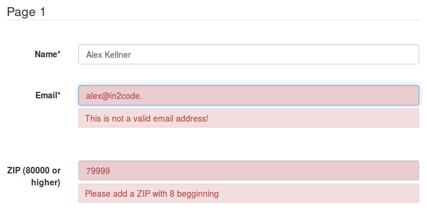
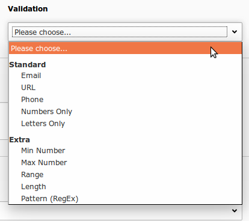
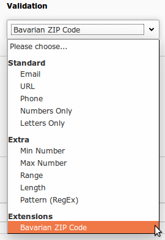

# Add new Validators

## Introduction

In powermail a combination of different validation types is possible:

- Serverside Validation (PHP)
- Clientside Validation (JavaScript)
- Clientside Validation (Native with HTML5)

You can enable or disable or combine some of the validation methods via TypoScript

```
plugin.tx_powermail.settings.setup {
   validation {
      native = 1
      client = 1
      server = 1
   }
}
```


Meanwhile we added an own robust JavaScript validation which also supports native HTML5 validation


Serverside Validation Example




Clientside Validation Example


## 1. Add a new validation type

A new validation types is a validiation that can be selected for a single field by the editor.
The following example includes clientside and serverside validation.

### Add new Option

Per default, all standard validators are available for a field



If you want to add a new validation, use Page TSConfig for this. In this case, we want to validate for a ZIP-Code
which is greater than 79999 (for bavarian ZIP within Germany):

`tx_powermail.flexForm.validation.addFieldOptions.100 = Bavarian ZIP Code`


This leads to a new validation option for the editors:



### Add new JavaScript Validation

You will see a HTML-Code like this for this field

`<input type="text" ... data-powermail-error-message="" data-powermail-custom100="80000" />`

Add a new Extension or simply a JavaScript File with this content. Please pay attention to the ordering.
This code must be included after all JavaScripts of powermail.

```
page.includeJSFooter.powermailextended = EXT:powermailextended/Resources/Public/JavaScripts/ZipValidation.js
page.includeJSFooter.powermailextended.defer = 1
```

```
/**
 * Add a ZIP validation to all powermail forms on the current page and listen to those fields:
 * <input type="text" data-powermail-custom100="80000" data-powermail-error-message="Please try again" />
 */
const forms = document.querySelectorAll('.powermail_form');
forms.forEach(function(form) {
    let formValidation = form.powermailFormValidation;

    formValidation.addValidator('custom100', function(field) {
        if (field.hasAttribute('data-powermail-custom100')) {
            // return true means validation has failed
            return field.value < parseInt(field.getAttribute('data-powermail-custom100'));
        }
        return false;
    });
});
```

See Extension powermailextended https://github.com/einpraegsam/powermailextended for details

### Add new PHP Validation

First of all, you have to register a PHP Class for your new validation via TypoScript (and an errormessage in case of a
negative validation).

```
plugin.tx_powermail {
    settings.setup {
        validation {
            customValidation {
                100 = In2code\Powermailextended\Domain\Validator\ZipValidator
            }
        }
    }
    _LOCAL_LANG.default.validationerror_validation.100 = Please add a ZIP with 8 begginning
}
```

In this case we choose a further Extension "powermailextended" and add a new file and folders
powermailextended/Classes/Domain/Validator/ZipValidator.php

The content:

```
<?php
namespace In2code\Powermailextended\Domain\Validator;

/**
* ZipValidator
*/
class ZipValidator
{

    /**
     * Check if given number is higher than in configuration
     *
     * @param string $value
     * @param string $validationConfiguration
     * @return bool
     */
    public function validate100($value, $validationConfiguration)
    {
        if (is_numeric($value) && $value >= $validationConfiguration) {
            return true;
        }
        return false;
    }
}
```

### Example Code

Look at https://github.com/einpraegsam/powermailextended for an example extension.
This extension allows you to:

- Extend powermail with a complete new field type (Just a small "Show Text" example)
- Extend powermail with an own Php and JavaScript validator (ZIP validator - number has to start with 8)
- Extend powermail with new field properties (readonly and prepend text from Textarea)
- Extend powermail with an example SignalSlot (see ext_localconf.php and EXT:powermailextended/Classes/Controller/FormController.php)


## 2. Add own global serverside validators

A global validator is something that could normally not be selected by an editor.

### 2a. Use a validator class

#### Introduction

Let's say you want to easily add your own php function to validate user inputs,
that should be called after a user submits a form, but of course before the createAction() is called.

#### Small example

Just define which classes should be used. Method validate() will be called:

```
plugin.tx_powermail.settings.setup {
    validators {
        1 {
            class = Vendor\Ext\Domain\Model\DoSomethingValidator
        }
    }
}
```


Add a php-file and extend your class with the AbstractValidator from powermail:

```
<?php
namespace Vendor\Ext\Domain\Model;

use In2code\Powermail\Domain\Validator\AbstractValidator;
use TYPO3\CMS\Extbase\Error\Error;
use TYPO3\CMS\Extbase\Error\Result;

/**
* Class DoSomethingValidator
*/
class DoSomethingValidator extends AbstractValidator
{

    /**
     * @param Mail $mail
     * @return Result
     */
    public function validate($mail)
    {
        // throw error
        $result = new Result();
        $result->addError(new Error('Error', 123456789, ['marker'=> 'firstname']));
        return $result;
    }
}
```


#### Extended example

See the advanced example with some configuration
in TypoScript and with the possibility to load the file
(useful if file could not be loaded from autoloader
because it's stored in fileadmin or elsewhere)

```
plugin.tx_powermail.settings.setup {
    validators {
        1 {
            # Classname that should be called with method *Validator()
            class = Vendor\Ext\Domain\Model\AlexValidator

            # optional: Add configuration for your PHP
            config {
                allowedValues = alex, alexander
                form = 210
            }

            # optional: If file will not be loaded from autoloader, add path and it will be called with require_once
            require = fileadmin/powermail/validator/AlexValidator.php
        }
    }
}
```

Add your php-file again and extend your class with the AbstractValidator from powermail:

```
<?php
namespace Vendor\Ext\Domain\Model;

use In2code\Powermail\Domain\Model\Mail;
use In2code\Powermail\Domain\Validator\AbstractValidator;
use TYPO3\CMS\Core\Utility\GeneralUtility;
use TYPO3\CMS\Extbase\Error\Result;
use TYPO3\CMS\Extbase\Error\Error;

/**
* Class AlexValidator
*
* @package Vendor\Ext\Validator
*/
class AlexValidator extends AbstractValidator
{

  /**
   * Field to check - select by {markername}
   *
   * @var string
   */
  protected $fieldMarker = 'firstname';

  /**
   * Validator configuration
   *
   * @var array
   */
  protected $configuration = [];

  /**
   * Check if value in Firstname-Field is allowed
   *
   * @param Mail $mail
   * @return Result
   */
  public function validate($mail)
  {
      $result = new Result();
      if ((int)$this->configuration['form'] === $mail->getForm()->getUid()) {
          foreach ($mail->getAnswers() as $answer) {
              if ($answer->getField()->getMarker() === $this->fieldMarker && !$this->isAllowedValue($answer->getValue())) {
                  $result->addError(new Error('Firstname must be "Alexander"', 123456789, ['marker' => $this->fieldMarker]));
              }
          }
      }
      return $result;
  }

  /**
   * Check if this value is allowed
   *
   * @return bool
   */
  protected function isAllowedValue($value)
  {
      $allowedValues = GeneralUtility::trimExplode(',', $this->configuration['allowedValues'], true);
      return in_array(strtolower($value), $allowedValues);
  }
}
```


### 2b. Use a slot with CustomValidator

#### Introduction

You can also use the CustomValidator (used twice in powermail
FormsController: confirmationAction and createAction) to write your
own field validation after a form submit.

The customValidator is located at
powermail/Classes/Domain/Validator/CustomValidator.php. A signalSlot
Dispatcher within the class waits for your extension.


#### SignalSlot in CustomValidator

| Signal Class Name | Signal Name | Located in Method | Passed arguments | Description |
|-------------------|-------------|-------------------|------------------|-------------|
| `In2code\Powermail\Domain\Validator\CustomValidator` | isValid | isValid() | $mail, $this | Add your own serverside Validation |

### Call the Custom Validator from your Extension

Add a new extension (example key powermail_extend).

Example ext_localconf.php:

```
$signalSlotDispatcher = \TYPO3\CMS\Core\Utility\GeneralUtility::makeInstance(
     \TYPO3\CMS\Extbase\SignalSlot\Dispatcher::class
 );
 $signalSlotDispatcher->connect(
      'In2code\Powermail\Domain\Validator\CustomValidator',
      'isValid',
      'Vendor\Extkey\Domain\Validator\CustomValidator',
      'addInformation',
      false
 );
```

Example file:

```
 class \Vendor\Extkey\Domain\Validator\CustomValidator
 {
         public function addInformation($params, $obj)
         {
                 // $field failed - set error
                 $obj->setErrorAndMessage($field, 'error message');
         }
 }
```

### Example Code

Look at https://github.com/einpraegsam/powermailextended for an example extension.
This extension allows you to:

- Extend powermail with a complete new field type (Just a small "Show Text" example)
- Extend powermail with an own Php and JavaScript validator (ZIP validator - number has to start with 8)
- Extend powermail with new field properties (readonly and prepend text from Textarea)
- Extend powermail with an example SignalSlot (see ext_localconf.php and EXT:powermailextended/Classes/Controller/FormController.php)


## 3. Add own global clientside validators

A global validator is something that could normally not be selected by an editor.

### Javascript validation introduction

Example form, validated with form validation framework, with a required and an email field.
In addition to HTML5, this input fields are validated now:

```
<form data-powermail-validate>
    <input type="text" name="firstname" required="required" />

    <input type="email" name="email" />

    <input type="submit" />
</form>
```

### Own JavaScript validator

#### Quick example

See how you can relate a JavaScript validator to a field with a data-attribute. In addition we recommend to set the
message also via data-attribute:

```
<input type="text" data-powermail-emailverification="@" data-powermail-emailverification-message="No email address" />
    [...]
<script type="text/javascript">
    const field = document.querySelector('[data-powermail-emailverification]');
    const form = field.closest('form');
    const formValidation = form.powermailFormValidation;

    formValidation.addValidator('emailverification', function(field) {
        if (field.hasAttribute('data-powermail-emailverification')) {
            return field.value.indexOf(field.getAttribute('data-powermail-emailverification')) === false;
        }
    });
</script>
```


#### Step by step

Let's build an own field (look at the section how to easily extend powermail with own fieldtypes) with two fields
where the user should add his/her email address twice. A validator should check if both strings are identical.

The example fluid template (partial):

```
{namespace vh=In2code\Powermail\ViewHelpers}

<div class="powermail_fieldwrap powermail_fieldwrap_type_emailverification powermail_fieldwrap_{field.marker} {field.css} {settings.styles.framework.fieldAndLabelWrappingClasses}">
	<label for="powermail_field_{field.marker}" class="{settings.styles.framework.labelClasses}" title="{field.description}">
		<vh:string.escapeLabels>{field.title}</vh:string.escapeLabels><f:if condition="{field.mandatory}"><span class="mandatory">*</span></f:if>
	</label>

	<div class="{settings.styles.framework.fieldWrappingClasses}">
		<f:form.textfield
				type="email"
				id="powermail_field_{field.marker}"
				property="{field.marker}"
				value=""
				additionalAttributes="{data-powermail-emailverification-message:'{f:translate(key:\'powermail.validation.emailverification\',extensionName:\'In2template\')}',data-powermail-emailverification:'{field.marker}_mirror'}"
				class="powermail_emailverification {settings.styles.framework.fieldClasses} {vh:Validation.ErrorClass(field:field, class:'powermail_field_error')}" />
	</div>
</div>

<div class="powermail_fieldwrap powermail_fieldwrap_type_emailverification powermail_fieldwrap_{field.marker}_mirror {field.css} {settings.styles.framework.fieldAndLabelWrappingClasses}">
	<label for="powermail_field_{field.marker}_mirror" class="{settings.styles.framework.labelClasses}">
		<f:translate key="writePasswordAgain" /><f:if condition="{field.mandatory}"><span class="mandatory">*</span></f:if>
	</label>

	<div class="{settings.styles.framework.fieldWrappingClasses}">
		<f:form.textfield
				type="email"
				id="powermail_field_{field.marker}_mirror"
				property="{field.marker}_mirror"
				value=""
				additionalAttributes="{data-powermail-emailverification-message:'{f:translate(key:\'powermail.validation.emailverification\',extensionName:\'In2template\')}',data-powermail-emailverification:'{field.marker}'}"
				class="powermail_emailverification {settings.styles.framework.fieldClasses} {vh:Validation.ErrorClass(field:field, class:'powermail_field_error')}" />
	</div>
</div>
```


The example JavaScript:

```
<script type="text/javascript">
    const field = document.querySelector('[data-powermail-emailverification]');
    const form = field.closest('form');
    const formValidation = form.powermailFormValidation;

    formValidation.addValidator('emailverification', function(field) {
        if (field.hasAttribute('data-powermail-emailverification')) {
            const id = field.getAttribute('id');
            return field.value !== document.querySelector('#' + id + '_mirror').value;
        }
        return error;
    });
</script>
```


### Example Code

Look at https://github.com/einpraegsam/powermailextended for an example extension.
This extension allows you to:

- Extend powermail with a complete new field type (Just a small "Show Text" example)
- Extend powermail with an own Php and JavaScript validator (ZIP validator - number has to start with 8)
- Extend powermail with new field properties (readonly and prepend text from Textarea)
- Extend powermail with an example SignalSlot (see ext_localconf.php and EXT:powermailextended/Classes/Controller/FormController.php)
