# Add a new Form

## Introduction

A powermail forms is the main record which contains multiple pages and fields.
So if you create and store a form, you can use this on one or more pages.
A form that is included in a pagecontent (in a plugin) will be shown
in frontend and can be used by website visitors.

### First step

Choose a page (could also be a folder) where to store the new form-record and change to the list view.
Click on the New Button to add a new record to this page and choose “Forms".

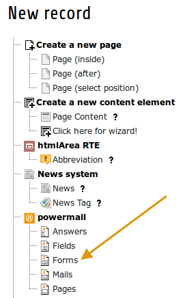

### Form settings

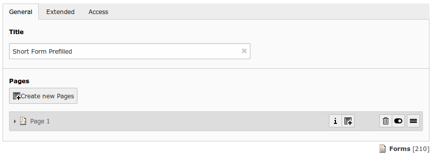

| Field | Description | Explanation | Tab |
|----------|----------------------------------|----------------------------------------------------------------------------------------------------------------------------------------------------------|----------|
| Title | Add a title for your form. | The title is used to find the form in the backend. You can also show the title in the frontend. | General |
| Pages | Add one or more pages to a form. | A form collects a couple of pages. You need minimum 1 page to show a  form. If you choose a multistep form, every step is splitted in one  page. | General |
| Layout | Choose a layout. | This adds a CSS-Class to the frontend output. Administrator can add,  remove or rename some of the entries and switch the frontend layout of  your form. | Extended |
| Language | Choose a language. | Choose in which frontend language this form should be rendered. | Access |
| Hide | Disable the form | Enable or disable a form with all pages and fields. | Access |
| Start | Startdate for this record. | Same function as known from default content elements or pages in TYPO3. | Access |
| Stop | Stopdate for this record. | Same function as known from default content elements or pages in TYPO3. | Access |

### Page Settings

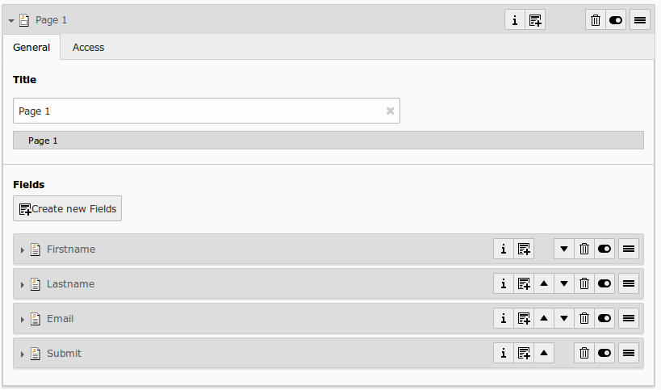

| Field | Description | Explanation | Tab |
|----------|--------------------------------------|----------------------------------------------------------------------------------------------------------------------------------------------------------------------------------------------------------------------------------------------------------------------------------------------------------------|----------|
| Title | Add a title for your page. | The title is used to find the page in the backend. You can also show the title in the frontend. | General |
| Fields | Add one or more fields to this page. | A page collects a couple of fields. You need minimum 1 field to show a form. | General |
| Note | Just a small Note (in some cases). | This note shows you if there is no Sendermail or Sendername marked in  the fields. Without this information powermail will set default values  for the Sendername and Senderemail. If you are aware of this and you  don’t want to see this information in future (for this form), you can  disable this note. | General |
| Layout | Choose a layout. | This adds a CSS-Class to the frontend output. Administrator can add, remove or rename some of the entries. | Extended |
| Language | Choose a language. | Choose in which frontend language this record should be rendered. | Access |
| Hide | Disable the form | Enable or disable this record. | Access |
| Start | Startdate for this record. | Same function as known from default content elements or pages in TYPO3. | Access |
| Stop | Stopdate for this record. | Same function as known from default content elements or pages in TYPO3. | Access |

### Field Settings

#### General

##### Backend Configuration Example

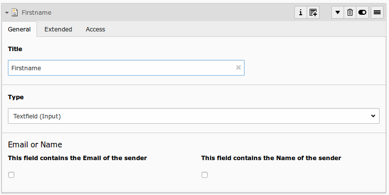

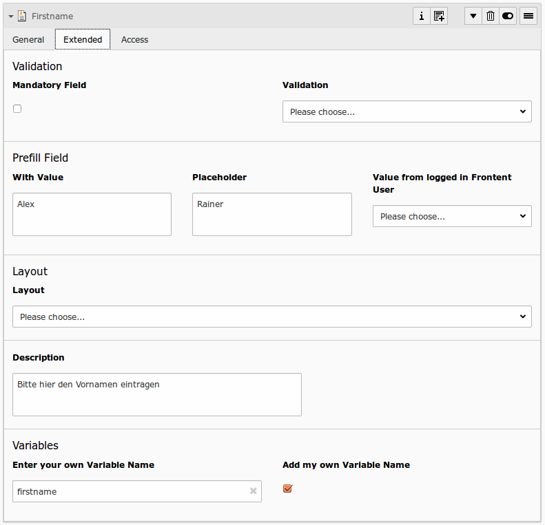

##### Explanation

| Field | Description | Explanation | Tab |
|------------------------------------|-----------------------------------------------------------------------------------|--------------------------------------------------------------------------------------------------------------------------------------------------------------------------------------------------------------------------|----------|
| Title | Add a label for this field. | The label is shown in the frontend near to this field. | General |
| Type | Choose a fieldtype. | See explanation below for a special fieldtype. Different fields are  related to some fieldtypes – not all fields are shown on every type. | General |
| Email of sender | Check this if this field contains the email of the sender. | This is needed to set the correct sender-email-address. If there is no  field marked as Senderemail within the current form, powermail will use a  default value for the Senderemail. | General |
| Name of sender | Check this if this field contains the name (or a part of the name) of the sender. | This is needed to set the correct sender-name. If there is no field  marked as Sendername within the current form, powermail will use a  default value for the Sendername. | General |
| Mandatory Field | This field must contain input. | Check this if the field must contain input, otherwise submitting the form is not possible. | Extended |
| Validation | Validate the user input with a validator. | Possible Validation Methods are: Email, URL, Phone, Numbers only,  Letters only, Min Number, Max Number, Range, Length, Pattern (RegEx) | Extended |
| Prefill with value | Prefill field value with a static content. | Other possibilities to prefill a field: TypoScript, GET or POST params | Extended |
| Placeholder | Add a placeholder for this input field. | A placeholder text is an example, that should help the user to fill out  an input field. This text is shown in bright grey within the input  field. If you have a name field, you could use the placeholder “John  Doe". | Extended |
| Value from logged in Frontend User | Check if field should be filled from the FE_Users table of a logged in fe_user. | This value overwrites a static value, if set. | Extended |
| Layout | Choose a layout. | This adds a CSS-Class to the frontend output. Administrator can add, remove or rename some of the entries. | Extended |
| Description | Add a description for this field. | Per default a description will be rendered as title-attribute in the labels in frontend. | Extended |
| Variables – Individual Fieldname | This is a marker of this field. | Use a field variable with {marker} in any RTE or HTML-Template. The marker name is equal in any language. | Extended |
| Add own Variable | Check this, if you want to set your own marker (see row before). | After checking this button, TYPO3 ask you to reload. After a reload, you see a new field for setting an own marker. | Extended |
| Language | Choose a language. | Choose in which frontend language this record should be rendered. | Access |
| Hide | Disable the form | Enable or disable this record. | Access |
| Start | Startdate for this record. | Same function as known from default content elements or pages in TYPO3. | Access |
| Stop | Stopdate for this record. | Same function as known from default content elements or pages in TYPO3. | Access |

##### Field types

| Field | Description | HTML | Tab | Example |
|-------------------------------------|:------------------------------------------------------------------------------------------------------------------------------------------------------------------------------------------------------------------------------------------------------------------------------------------------------:|-----------------------------------------------------------------:|----------|---------|
| Textfield (input) | Simple text field (one line) | `<input type="text" />` | Standard | 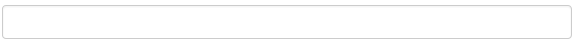 |
| Textfield with more rows (Textarea) | Text field with more lines | `<textarea></textarea>` | Standard |  |
| Selectfield | Selector box (Dropdown) | `<select><option>X</option></select>` | Standard | 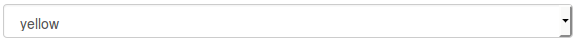 |
| Checkboxes | Checkbox (Possibility to select more than only one) | `<input type="checkbox" />` | Standard | 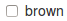 |
| Radiobuttons | Radio Buttons (Possibility to check only one) | `<input type="radio" />` | Standard | 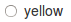 |
| Submit | Send Form | `<input type="submit" />` | Standard |  |
| Captcha | Captcha Check against spam | `<input type="text" />` | Extended | 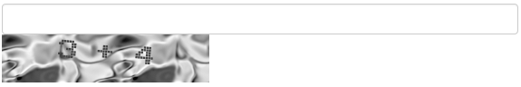 |
| Reset | Reset cleans all fieldvalues in the form | `<input type="reset" /> `| Extended | 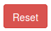 |
| Show some text | This field let you show some text in the form | `This is a Test` | Extended |  |
| Content Element | Show an existing Content Element | `Text with ` | Extended | 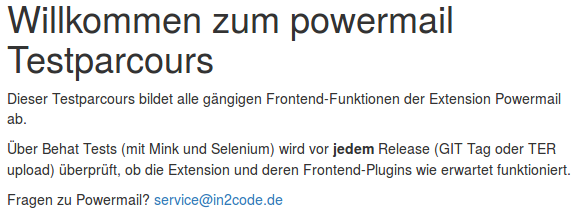 |
| Show HTML | Add some html text. Per default output of fields of type HTML is parsed  through a htmlspecialchars() function to avoid Cross-Site-Scripting for  security reasons. If you are aware of possible XSS-problems, caused by  editors, you can enable it and your original HTML is shown in the  Frontend. | `This is a <b>Test</b>` | Extended | 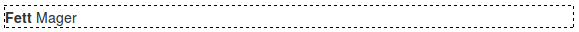 |
| Password Field | Two fields for a password check | `<input type="password" /> <input type="password" />` | Extended | 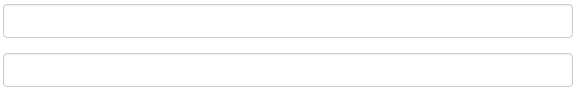 |
| File Upload | Upload one or more files | `<input type="file" />` | Extended | 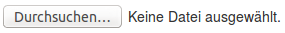 |
| Hidden Field | Renders a hidden field, where you can store some additional information within the form. | `<input type="hidden" />` | Extended | |
| Date | Datepicker field (Date, Datetime or Time) | `<input type="date" />` | Extended | 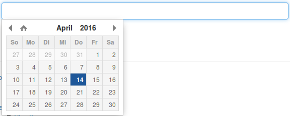 |
| Countryselection | Choose a Country | `<select><option>France</option><option>Germany</option></select>` | Extended | 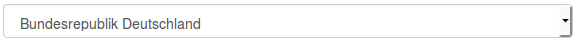 |
| Location | Location field. Browser will ask the user if it’s ok to fill the field with his current location. | `<input type="text" />` | Extended |  |
| TypoScript | Fill values from TypoScript | `This is a <b>Test</b>` | Extended | 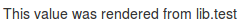 |

##### Type documentation details

* [Input](FieldInput.md)
* [Textarea](FieldTextarea.md)
* [Select](FieldSelect.md)
* [Checkboxes](FieldCheck.md)
* [Radio Buttons](FieldRadio.md)
* [Submit Button](FieldSubmit.md)
* [Captcha](FieldCaptcha.md)
* [Reset Button](FieldReset.md)
* [Text](FieldText.md)
* [Content Element](FieldContentElement.md)
* [HTML](FieldHtml.md)
* [Password](FieldPassword.md)
* [File Upload](FieldFile.md)
* [Hidden](FieldHidden.md)
* [Date](FieldDate.md)
* [Country Selection](FieldCountry.md)
* [Location](FieldLocation.md)
* [TypoScript](FieldTypoScript.md)
