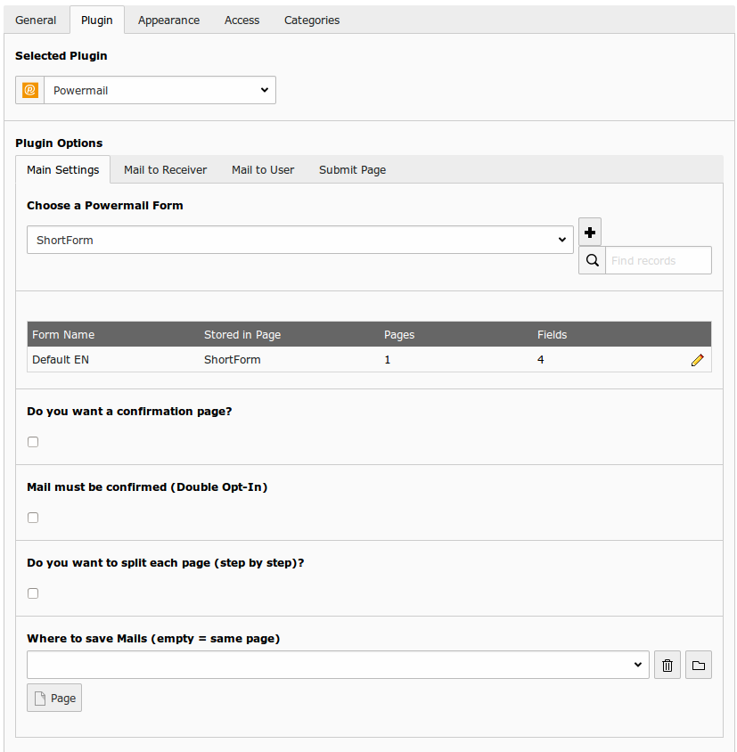
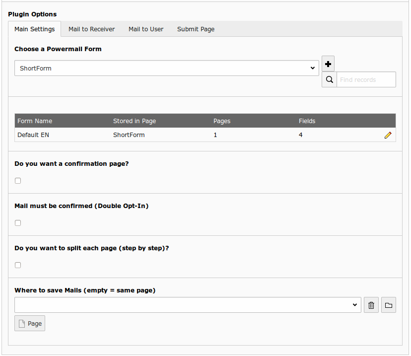
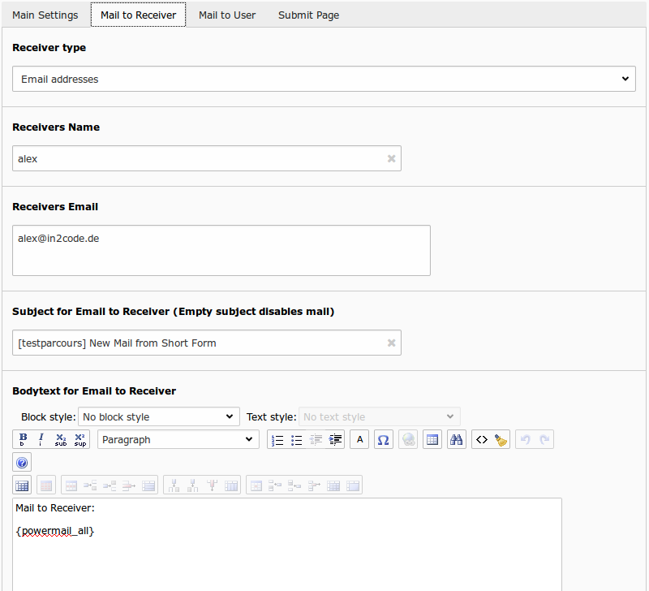
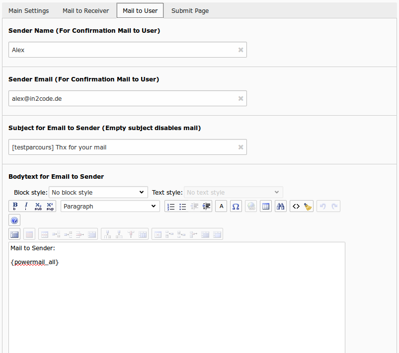
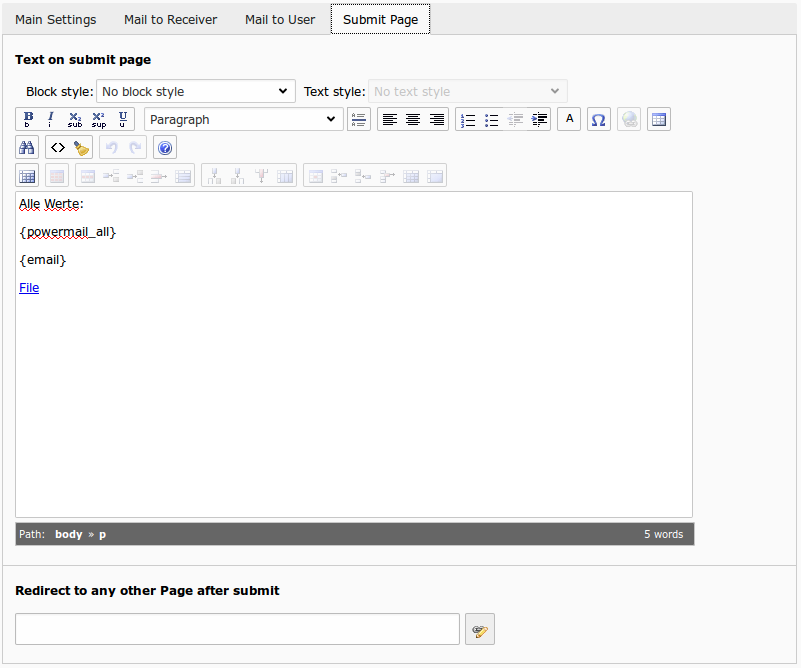

# Add a new Plugin

## Introduction

If you want to show an existing Powermail form (see :ref:`addANewForm`) in Frontend,
you have to insert a page content to any page and make some main configuration
(select form, insert email, subject, etc...)

## First step

Choose a page where you want to show a powermail form in the Frontend
and go to the page module. Click on the New Button to add a new
content element to this page and choose “powermail”.

## Plugin Settings

You will find the plugin settings within the tab “Plugin”. In this
area you see another four tabs (Main Settings, Receiver, Sender,
Submit Page).

### Main Settings

#### Example Configuration

#### Explanation

| Field | Description | Explanation | Tab |
|----------------------------------------|-----------------------|-------------------------|------------------------------------|
| Choose a Powermail Form | Choose an existing powermail form. | Choose an existing form or create a new one by clicking the plus symbol. With this the form (with all pages and fields) will be created on the same page. | Main Settings |
| Form Table | The table shows some form information | If you choose a form and save this content element, a table is visible which gives you some interesting information about the chosen form (Form Name, Form is stored in Page, Number of Pages, Number of Fields). You can edit the form, by clicking the edit icon or the Form Name. If you want to open the page, where the form is stored in, click the Page Title. | Main Settings |
| Confirmation Page | Enable a confirmation page. | This enables a confirmation page (Are these values correct?) to the frontend | Main Settings |
| Double-Opt-In | Add Double-Opt-In feature to this form. | A user has to confirm his email by clicking a link in a mail first before the main mail is sent. Note: You can overwrite the email to the user by administrators email address with TypoScript. | Main Settings |
| Step by step | Enable morestep form. | Each page (fieldset) will be splittet to one page in the frontend. With JavaScript the user can switch between the pages. | Main Settings |
| Where to save Mails | Choose a page where to store the mails in the database. | You can select a page or a folder. Leaving this empty will store the mails on the same page. | Main Settings |

### Receiver

#### Example Configuration

#### Explanation

| Field | Description | Explanation | Tab |
|----------------------------------------|-----------------------|-------------------------|------------------------------------|
| Receivers Name | Add the name of the main receiver name. | - Add a static value - Add a variable like {firstname}  - Add a viewhelper call like {f:cObject(typoscriptObjectPath:'lib.test')} to get a value from TypoScript or a userFunc - or mix dynamic and static values | Mail to Receiver |
| Receivers Mail | Add the email address of one or more receivers | - Add one or more static values (split with a new line) - Add a variable like {email} - Add a viewhelper call like {f:cObject(typoscriptObjectPath:'lib.test')} to get a value from TypoScript or a userFunc - or mix dynamic and static values | Mail to Receiver |
| Frontend User Group | Choose a Frontend User Group. | Select an existing group to send the mail to all users of a given group. | Mail to Receiver |
| Subject | Subject for mail to receiver. | - Add a static value - Add a variable like {firstname}  Add a viewhelper call like {f:cObject(typoscriptObjectPath:'lib.test')} to get a value from TypoScript or a userFunc - or mix dynamic and static values | Mail to Receiver |
| Bodytext | Add some text for the mail to the receiver. | - Add a static value - Add {powermail_all} to get all values from the form in one table (with labels) - Add a variable like {firstname} - Add a viewhelper call like {f:cObject(typoscriptObjectPath:'lib.test')} to get a value from TypoScript or a userFunc - or mix dynamic and static values | Mail to Receiver |

### Sender

#### Example Configuration

#### Explanation

| Field | Description | Explanation | Tab |
|----------------------------------------|-----------------------|-------------------------|------------------------------------|
| Senders Name | Add the name of the sender for confirmation mail. | Add the name of the sender for the mail that will be send as confirmation mail back to the user. That is normally a static value. If you want to overwrite it or set it dynamically, please use TypoScript (see Setup). | Mail to User |
| Sender Email | Add the email address of the sender for confirmation mail. | Add the email of the sender for the mail that will be send as confirmation mail back to the user. That is normally a static value. If you want to overwrite it or set it dynamically, please use TypoScript (see Setup). | Mail to User |
| Subject | Subject for confirmation mail to sender. Leaving subject empty disables the mail to the sender. | - Add a static value - Add a variable like {firstname} - Add a viewhelper call like {f:cObject(typoscriptObjectPath:'lib.test')} to get a value from TypoScript or a userFunc  or mix dynamic and static values | Mail to User |
| Bodytext | Add some text for the confirmation mail to sender. | - Add a static value - Add {powermail_all} to get all values from the form in one table (with labels) - Add a variable like {firstname} - Add a viewhelper call like {f:cObject(typoscriptObjectPath:'lib.test')} to get a value from TypoScript or a userFunc - or mix dynamic and static values | Mail to User |

### Submit Page

#### Example Configuration

#### Explanation

| Field | Description | Explanation | Tab |
|----------------------------------------|-----------------------|-------------------------|------------------------------------|
| Text on submit page | Add some text for submit message. This text will be shown right after a successful submit. | - Add a static value - Add {powermail_all} to get all values from the form in one table (with labels) - Add a variable like {firstname} - Add a viewhelper call like {f:cObject(typoscriptObjectPath:'lib.test')} to get a value from TypoScript or a userFunc - or mix dynamic and static values | Submit Page |
| Redirect | Add a redirect target instead of adding text (see row above). | As soon as the form is submitted, the user will be redirected to the target (internal page, external URL, document, mail address), even if there are values in the field "Text on submit page" | Submit Page |

### Powermail content element in page module

When you save your plugin and go back to the page module, you will see the content element with some additional
information. If you do not want to see this information, you can turn it off in the Extension Manager.

#### Example Image

| Part | Description | Link |
|----------------------------------------|-----------------------|-------------------------|
| Title of content element | You will see the title of the content element | If you click on the title or the edit icon aside, the content element will be opened for editing |
| Form title | Title of the chosen form | If you click on the form title or the edit icon aside, the form record will be opened for editing |
| Receiver email address | This part shows the configured receiver email address. If TYPO3 runs in development context, and there is an email set for development context, you will see this in red letters. | - |
| Receiver name | This part shows the configured receiver name. | - |
| Mail subject | This part shows the configured mail subject. | - |
| Confirmation page activated | This part shows if a confirmation page was activated. | - |
| Double-opt-in activated | This part shows if a double-opt-in page was activated. | - |
| Last mails | This part shows the last three mails that where submitted to the same form (If the form is used on different pages, you will also see mails from different pages). Note: This part can be deactivated in the Extension Manager | If you click on a mail subject or the icon aside, the mail record will be opened to edit. If you click on more or the search icon aside, the powermail backend module will be opened. |
