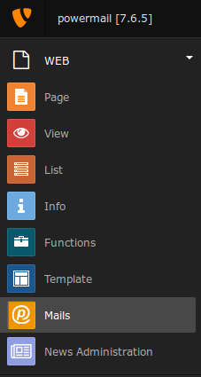
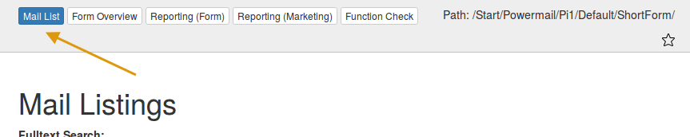
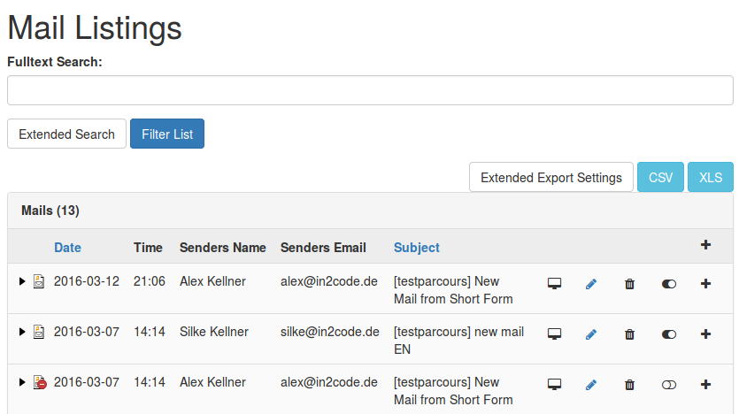
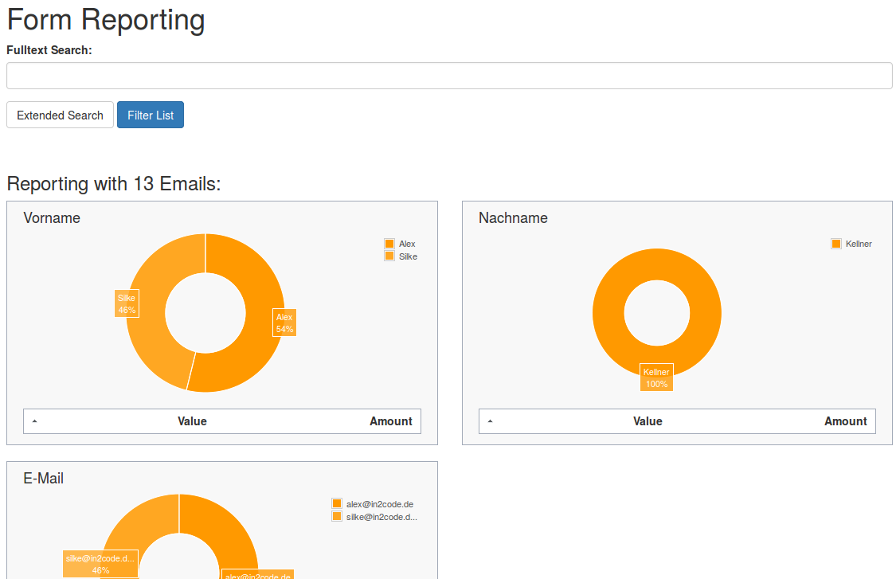
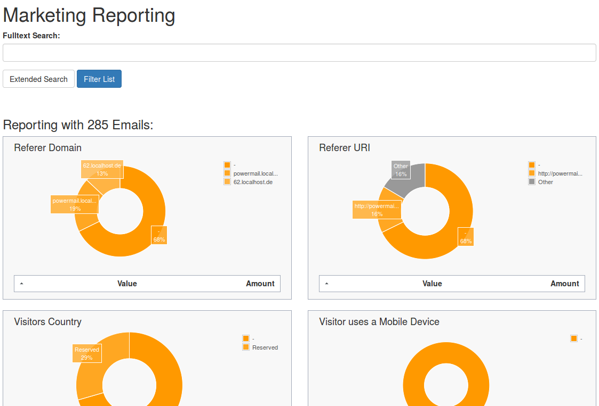
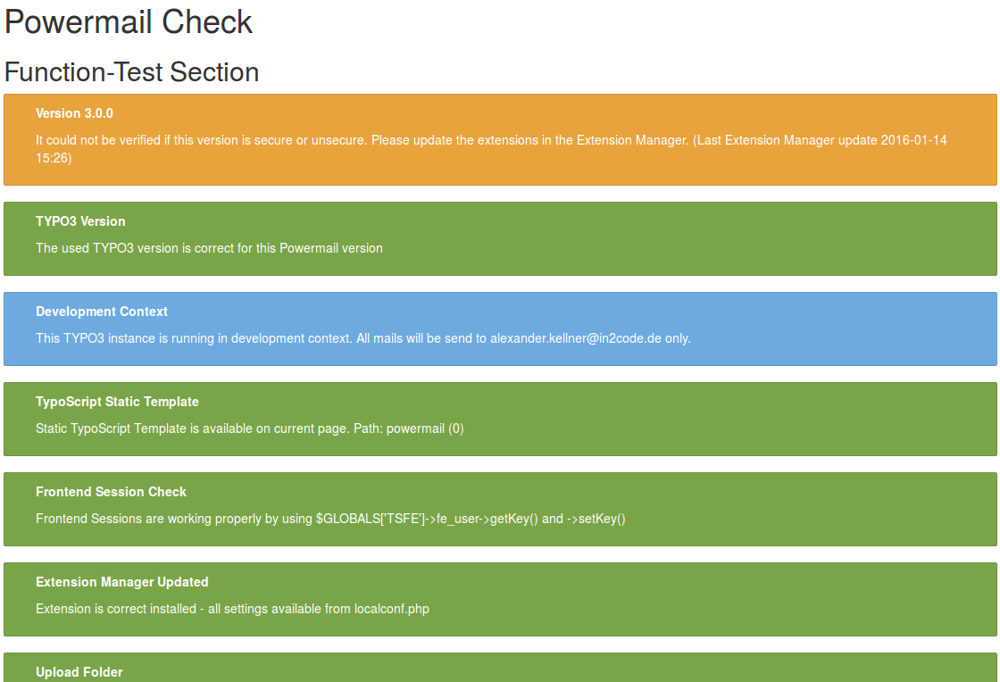

# Mail Backend Module

## Introduction

Per default powermails adds a new backend module to the TYPO3 backend.
This module helps you to manage mails and forms.

### First step

Open the Mail Backend Module and choose a page with mails in the foldertree. You will see all stored mails.

The Backend Module will start with the mail listing.

#### Mail List

If the page contains mails, all mails will be listet. The area over the mail list is
splitted into two parts (Search part and Export part).

##### Search Area

| Field | Description | Explanation |
|-------|-------------|-------------|
| Fulltext Search | This is the main search field for a full text search. | If you enter a searchterm all fields of the mail and of the answers are searched by your term (technical note: OR and LIKE %term%) |
| Filter List Button | Submit Button for search. | This is the main submit button which should be clicked if you're using the fulltext search, even if you use some other fields (like Start, Stop, etc...). |
| Start | Choose a Start Date for the filter list. | A datepicker will be opened on click (if the browser do not respect html5 datetime) to set Date and Time for the beginning of the timeframe. |
| Stop | Choose a Stop Date for the filter list. | A datepicker will be opened on click (if the browser do not respect html5 datetime) to set Date and Time for the ending of the timeframe. |
| Sender Name | Search through the sender name field of the stored mail. | All fields are related to each other with OR. |
| Sender Email | Search through the sender email field of the stored mail. | All fields are related to each other with OR. |
| Subject | Search through the subjtect field of the stored mail. | All fields are related to each other with OR. |
| Deactivated Mails | Show only activated or deactivated mails. | Deactivated mails could be interesting if you use Double-Opt-In e.g. |
| Additional Fields | One or more fields - depending on the form - are listed (e.g. firstname, lastname, email, etc...). | All fields are related to each other with OR. |

##### Export Area

Export Area gives you the possibility to export your mails in XLS or
CSV format.
Note: For editors only enabled fields are free to export.

If it is not possible to select any fields, please check if the form itself is disabled or a start / stop date
is set. For the export to work, the form must be in an "active" state. 

| Field | Description | Explanation |
|-------|-------------|-------------|
| XLS Button | If you want to export the current list in XLS-Format, click the button. XLS-Files can be opened with Microsoft Excel or Open Office (e.g.). | If you filter or sort the list before, the export will only export the filtered mails. See “Columns in Export File” if you want to change the export file columns. |
| CSV Button | If you want to export the current list in CSV-Format, click the button. CSV-Files can be opened with Microsoft Excel or Open Office (e.g.). | If you filter or sort the list before, the export will only export the filtered mails. See “Columns in Export File” if you want to change the export file columns. |
| Columns in Export File | This area shows the columns and the ordering of the rows in the export-file. You can play around with drag and drop. | Change sorting: Drag and drop a line up or down Add row: Choose a line of the “Available Columns” and drop on “Columns in Export File” Remove row: Drag line and move to the “Available Columns” |
| Available Columns | This area shows the available columns that can be used in the export file | See Row before for an explanation. |

#### Form Overview

This is a very helpful list with all powermail forms of your installation.
This table helps you to manage your forms, even in large installations.

| Field | Description | Explanation |
|-------|-------------|-------------|
| Form Title | Form Title | Click on Form title will open the form edit view. Mouseover will show you the Form UID. |
| Stored on Page | This form is stored in this Page | Click on Page title will open the page in page view. Mouseover will show you the Page UID. |
| Used on Page | This form can be used on different Pages. One line for one page. | Click on a Page title will open the page in page view. Mouseover will show you the Page UID. |
| Powermail Pages | Amount of Powermail Pages within this form | Mouseover will show you the Powermail-Page-Names. |
| Powermail Fields | Amount of Powermail Fields within this form | Mouseover will show you the Powermail-Field-Names. |
| Edit Icon | Edit the form | Same function as click on Form name. |

#### Reporting (Form)

This view helps you to get a small overview over form values.
Filter Mails in the same way as the listing with the filter area.
Below the Filter Area you will see some small diagrams (one diagram for each field in the form on this page).

#### Reporting (Marketing)

This view helps you to get a small overview over the most important information about your visitors.
Filter Mails in the same way as the listing with the filter area.
Below the Filter Area you will see some small diagrams (Referer Domain, Referer URI, Visitors Country, Visitor uses a Mobile Device, Website Language, Browser Language, Page Funnel).
Note: To activate the marketing information, please add the Powermail Marketing Static Template to your Root page.

#### Function check

This views helps you to identify problems with your TYPO3-Installation and Powermail.
Beside some basic checks there is a mail function. This function basicly works like the main powermail mail function. Test this function if your forms don't send mails.

Note: This view is for admins only.

