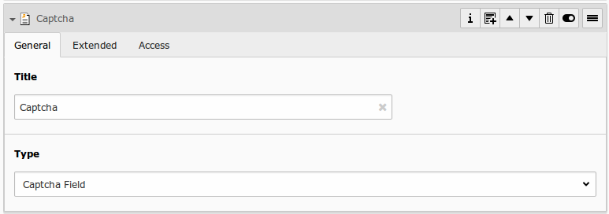
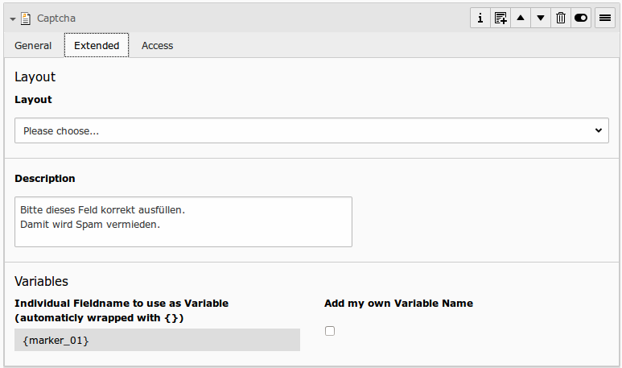

# Captcha Field

## What does it do?

- **General:** Want to prevent spam? Spamshield is integrated in powermail 2.x. In addtion you can add a calculating-captcha field to the form. The form can only be submitted if the result of the captcha is correct. You can use another captcha extension instead of the build-in calculating captcha (see TypoScript part).

## Frontend Output Example

## Backend Configuration Example

## Explanation

| Field | Description | Explanation | Tab |
|------------------------------------|-----------------------------------------------------------------------------------|--------------------------------------------------------------------------------------------------------------------------------------------------------------------------------------------------------------------------|----------|
| Title | Add a label for this field. | The label is shown in the frontend near to this field. | General |
| Type | Choose a fieldtype. | See explanation below for a special fieldtype. Different fields are  related to some fieldtypes – not all fields are shown on every type. | General |
| Description | Add a description for this field. | Per default a description will be rendered as title-attribute in the labels in frontend. | Extended |
| Variables – Individual Fieldname | This is a marker of this field. | Use a field variable with {marker} in any RTE or HTML-Template. The marker name is equal in any language. | Extended |
| Add own Variable | Check this, if you want to set your own marker (see row before). | After checking this button, TYPO3 ask you to reload. After a reload, you see a new field for setting an own marker. | Extended |
| Language | Choose a language. | Choose in which frontend language this record should be rendered. | Access |
| Hide | Disable the form | Enable or disable this record. | Access |
| Start | Startdate for this record. | Same function as known from default content elements or pages in TYPO3. | Access |
| Stop | Stopdate for this record. | Same function as known from default content elements or pages in TYPO3. | Access |
