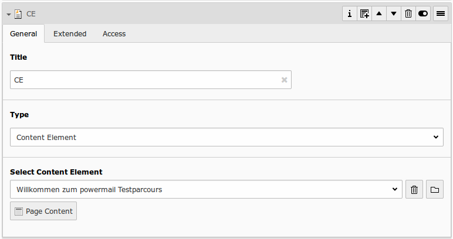
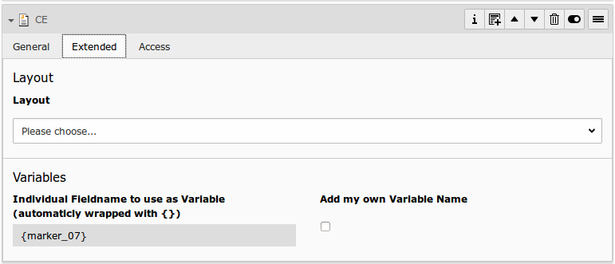

# Content Element

## What does it do?

- **General:** If you want to show a content element within your form (text, text with image, etc...), use this field. An element browser allows you to select a tt_content record. This text is not submitted.

## Frontend Output Example

## Backend Configuration Example

## Explanation

| Field | Description | Explanation | Tab |
|------------------------------------|-----------------------------------------------------------------------------------|--------------------------------------------------------------------------------------------------------------------------------------------------------------------------------------------------------------------------|----------|
| Title | Add a label for this field. | The label is shown in the frontend near to this field. | General |
| Type | Choose a fieldtype. | See explanation below for a special fieldtype. Different fields are  related to some fieldtypes – not all fields are shown on every type. | General |
| Select Content Element | Select an existing content element to show. | Select any existing content element in the element browser. This Content Element will be rendered in the frontend. | General |
| Variables – Individual Fieldname | This is a marker of this field. | Use a field variable with {marker} in any RTE or HTML-Template. The marker name is equal in any language. | Extended |
| Add own Variable | Check this, if you want to set your own marker (see row before). | After checking this button, TYPO3 ask you to reload. After a reload, you see a new field for setting an own marker. | Extended |
| Language | Choose a language. | Choose in which frontend language this record should be rendered. | Access |
| Hide | Disable the form | Enable or disable this record. | Access |
| Start | Startdate for this record. | Same function as known from default content elements or pages in TYPO3. | Access |
| Stop | Stopdate for this record. | Same function as known from default content elements or pages in TYPO3. | Access |
