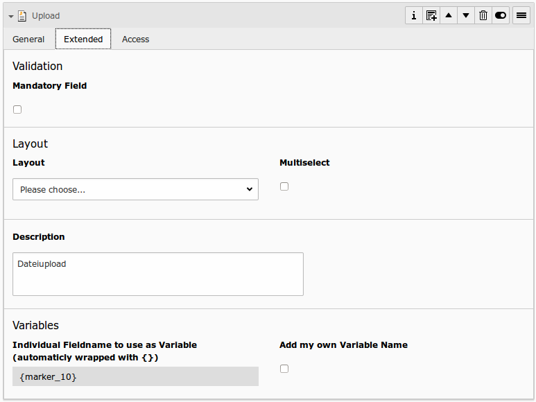

# File Upload

## What does it do?

- **General:** Enable a fileupload in frontend with this field. Multiupload is possible with modern browsers (HTML5 needed). Allowed filesize and fileextensions and a randomize Filename function can be set via TypoScript.

## Frontend Output Example

## Backend Configuration Example

## Explanation

| Field | Description | Explanation | Tab |
|------------------------------------|-----------------------------------------------------------------------------------|--------------------------------------------------------------------------------------------------------------------------------------------------------------------------------------------------------------------------|----------|
| Title | Add a label for this field. | The label is shown in the frontend near to this field. | General |
| Type | Choose a fieldtype. | See explanation below for a special fieldtype. Different fields are  related to some fieldtypes – not all fields are shown on every type. | General |
| Mandatory Field | This field must contain input. | Check this if the field must contain a file for an upload, otherwise submitting the form is not possible. | Extended |
| Layout | Choose a layout. | This adds a CSS-Class to the frontend output. Administrator can add, remove or rename some of the entries. | Extended |
| Multiselect | Allow upload of more than only one file. | Multiupload via HTML5 - the visitors browser must support this feature. If not, only one file could be uploaded. | Extended |
| Description | Add a description for this field. | Per default a description will be rendered as title-attribute in the labels in frontend. | Extended |
| Variables – Individual Fieldname | This is a marker of this field. | Use a field variable with {marker} in any RTE or HTML-Template. The marker name is equal in any language. | Extended |
| Add own Variable | Check this, if you want to set your own marker (see row before). | After checking this button, TYPO3 ask you to reload. After a reload, you see a new field for setting an own marker. | Extended |
| Language | Choose a language. | Choose in which frontend language this record should be rendered. | Access |
| Hide | Disable the form | Enable or disable this record. | Access |
| Start | Startdate for this record. | Same function as known from default content elements or pages in TYPO3. | Access |
| Stop | Stopdate for this record. | Same function as known from default content elements or pages in TYPO3. | Access |
