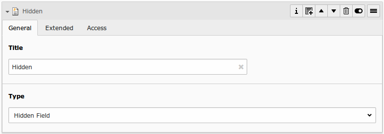
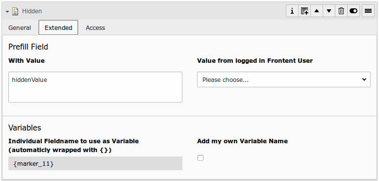

# Hidden Field

## What does it do?

- **General:** It could be useful to send some values within the form, that should not be displayed in frontend. Use a hidden field for this.
- **Prefill:** This field can be prefilled from FlexForm, TypoScript, GET/Post-Params or from FE_User table.

## Frontend Output Example

Because it is "hidden", there is no visible frontend output :)

## Backend Configuration Example

## Explanation

| Field | Description | Explanation | Tab |
|------------------------------------|-----------------------------------------------------------------------------------|--------------------------------------------------------------------------------------------------------------------------------------------------------------------------------------------------------------------------|----------|
| Title | Add a label for this field. | The label is shown in the frontend near to this field. | General |
| Type | Choose a fieldtype. | See explanation below for a special fieldtype. Different fields are  related to some fieldtypes – not all fields are shown on every type. | General |
| Email of sender | Check this if this field contains the email of the sender. | This is needed to set the correct sender-email-address. If there is no  field marked as Senderemail within the current form, powermail will use a  default value for the Senderemail. | General |
| Name of sender | Check this if this field contains the name (or a part of the name) of the sender. | This is needed to set the correct sender-name. If there is no field  marked as Sendername within the current form, powermail will use a  default value for the Sendername. | General |
| Prefill with value | Prefill field value with a static content. | Other possibilities to prefill a field: TypoScript, GET or POST params | Extended |
| Value from logged in Frontend User | Check if field should be filled from the FE_Users table of a logged in fe_user. | This value overwrites a static value, if set. | Extended |
| Variables – Individual Fieldname | This is a marker of this field. | Use a field variable with {marker} in any RTE or HTML-Template. The marker name is equal in any language. | Extended |
| Add own Variable | Check this, if you want to set your own marker (see row before). | After checking this button, TYPO3 ask you to reload. After a reload, you see a new field for setting an own marker. | Extended |
| Language | Choose a language. | Choose in which frontend language this record should be rendered. | Access |
| Hide | Disable the form | Enable or disable this record. | Access |
| Start | Startdate for this record. | Same function as known from default content elements or pages in TYPO3. | Access |
| Stop | Stopdate for this record. | Same function as known from default content elements or pages in TYPO3. | Access |
