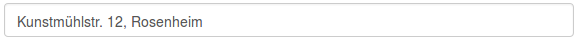
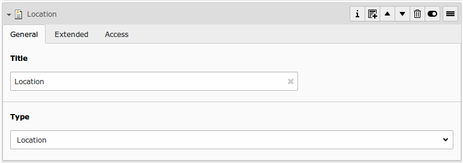
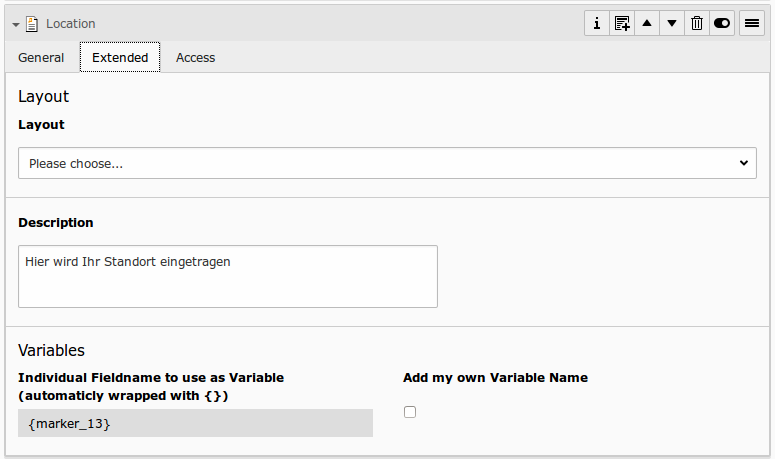

# Location

## What does it do?

- **General:** The location field is an input field, which could be prefilled with JavaScript. The user is asked if he wants to allow the filling with his current location. If he clicks on yes, the field is prefilled with Street, Streetnumber and Country.

## Frontend Output Example

## Backend Configuration Example

## Explanation

| Field | Description | Explanation | Tab |
|------------------------------------|-----------------------------------------------------------------------------------|--------------------------------------------------------------------------------------------------------------------------------------------------------------------------------------------------------------------------|----------|
| Title | Add a label for this field. | The label is shown in the frontend near to this field. | General |
| Type | Choose a fieldtype. | See explanation below for a special fieldtype. Different fields are  related to some fieldtypes – not all fields are shown on every type. | General |
| Layout | Choose a layout. | This adds a CSS-Class to the frontend output. Administrator can add, remove or rename some of the entries. | Extended |
| Description | Add a description for this field. | Per default a description will be rendered as title-attribute in the labels in frontend. | Extended |
| Variables – Individual Fieldname | This is a marker of this field. | Use a field variable with {marker} in any RTE or HTML-Template. The marker name is equal in any language. | Extended |
| Add own Variable | Check this, if you want to set your own marker (see row before). | After checking this button, TYPO3 ask you to reload. After a reload, you see a new field for setting an own marker. | Extended |
| Language | Choose a language. | Choose in which frontend language this record should be rendered. | Access |
| Hide | Disable the form | Enable or disable this record. | Access |
| Start | Startdate for this record. | Same function as known from default content elements or pages in TYPO3. | Access |
| Stop | Stopdate for this record. | Same function as known from default content elements or pages in TYPO3. | Access |
