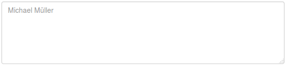
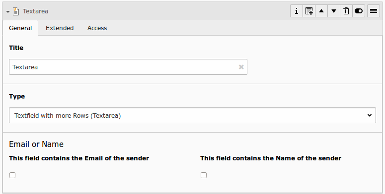
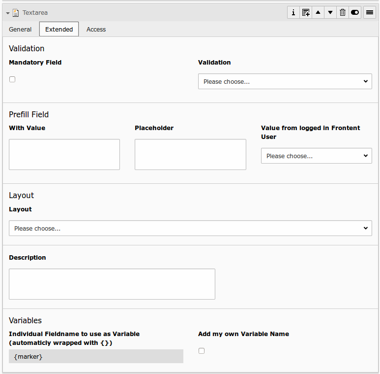

# Text with more rows (Textarea)

## What does it do?

- **General:** A texarea basicly works like a normal input field, but offers the possibility to write in multiple lines.
- **Mandatory:** This field could be marked as mandatory, so the user must fill out this field, otherwise the form can not be submitted.
- **Validation:** This field can also be validated (HTML5, JavaScript and/or PHP) for different inputtypes (email, url, phone, numbers only, letters only, min number, max number, range, length, pattern)
- **Prefill:** An input field can be prefilled from FlexForm, TypoScript, GET/Post-Params or from FE_User table.

## Frontend Output Example

## Backend Configuration Example

## Explanation

| Field | Description | Explanation | Tab |
|------------------------------------|-----------------------------------------------------------------------------------|--------------------------------------------------------------------------------------------------------------------------------------------------------------------------------------------------------------------------|----------|
| Title | Add a label for this field. | The label is shown in the frontend near to this field. | General |
| Type | Choose a fieldtype. | See explanation below for a special fieldtype. Different fields are  related to some fieldtypes – not all fields are shown on every type. | General |
| Email of sender | Check this if this field contains the email of the sender. | This is needed to set the correct sender-email-address. If there is no  field marked as Senderemail within the current form, powermail will use a  default value for the Senderemail. | General |
| Name of sender | Check this if this field contains the name (or a part of the name) of the sender. | This is needed to set the correct sender-name. If there is no field  marked as Sendername within the current form, powermail will use a  default value for the Sendername. | General |
| Mandatory Field | This field must contain input. | Check this if the field must contain input, otherwise submitting the form is not possible. | Extended |
| Validation | Validate the user input with a validator. | Possible Validation Methods are: Email, URL, Phone, Numbers only,  Letters only, Min Number, Max Number, Range, Length, Pattern (RegEx) | Extended |
| Prefill with value | Prefill field value with a static content. | Other possibilities to prefill a field: TypoScript, GET or POST params | Extended |
| Placeholder | Add a placeholder for this input field. | A placeholder text is an example, that should help the user to fill out  an input field. This text is shown in bright grey within the input  field. If you have a name field, you could use the placeholder “John  Doe". | Extended |
| Value from logged in Frontend User | Check if field should be filled from the FE_Users table of a logged in fe_user. | This value overwrites a static value, if set. | Extended |
| Layout | Choose a layout. | This adds a CSS-Class to the frontend output. Administrator can add, remove or rename some of the entries. | Extended |
| Description | Add a description for this field. | Per default a description will be rendered as title-attribute in the labels in frontend. | Extended |
| Variables – Individual Fieldname | This is a marker of this field. | Use a field variable with {marker} in any RTE or HTML-Template. The marker name is equal in any language. | Extended |
| Add own Variable | Check this, if you want to set your own marker (see row before). | After checking this button, TYPO3 ask you to reload. After a reload, you see a new field for setting an own marker. | Extended |
| Language | Choose a language. | Choose in which frontend language this record should be rendered. | Access |
| Hide | Disable the form | Enable or disable this record. | Access |
| Start | Startdate for this record. | Same function as known from default content elements or pages in TYPO3. | Access |
| Stop | Stopdate for this record. | Same function as known from default content elements or pages in TYPO3. | Access |
