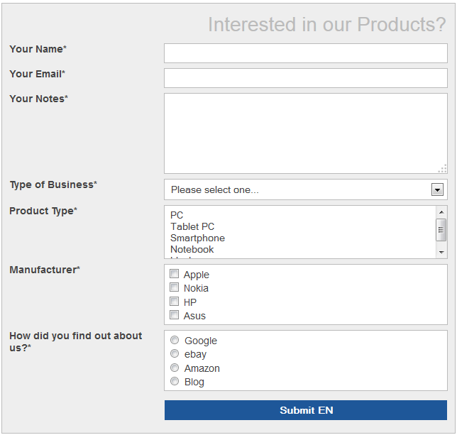
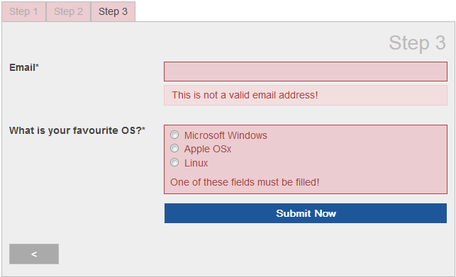
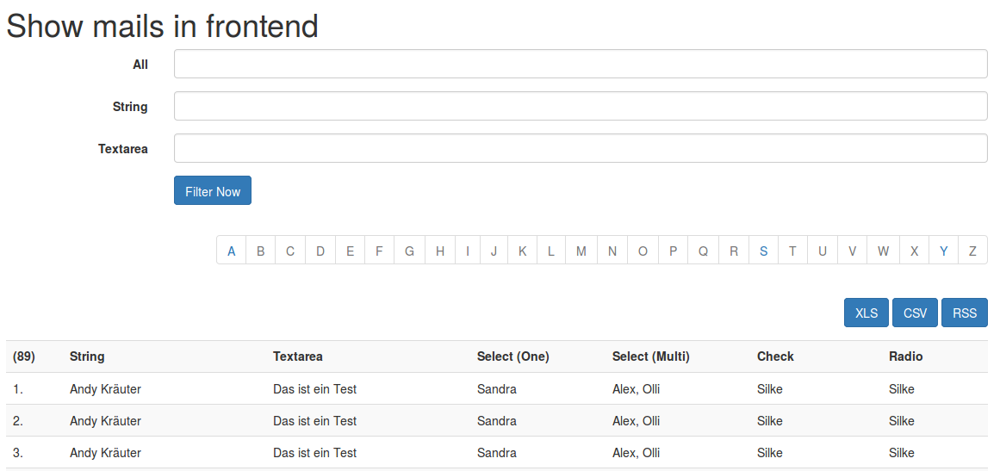
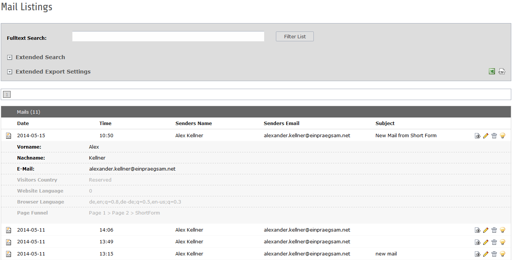
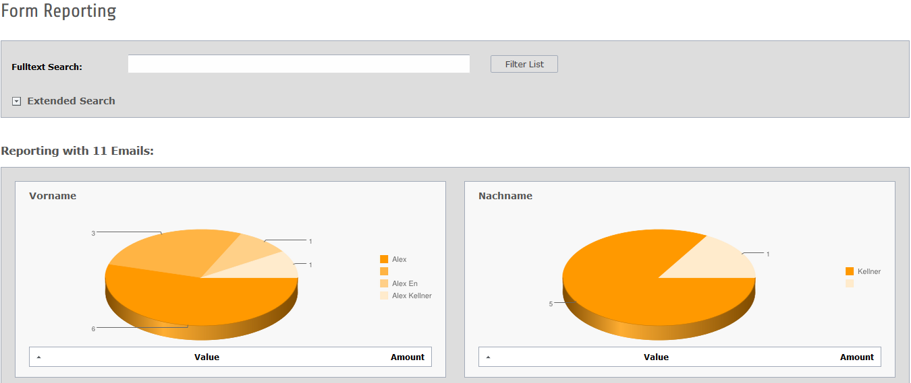

# TYPO3 Extension powermail - Documentation

This documentation helps
* Administrators to install and configure powermail
* Editors to use powermail
* Developers to extend powermail

## What does powermail do?

Powermail is a powerful and – in addition – a very easy mailform
extension with a wide range of tools and features for editors, admins
and developers. Define your form in the backend with a few clicks and
look at the final output in the frontend.

Some basic points:

- Main features of this mailform extension is to store the mails into
  the database. Export it from the backend module (xls, csv) or list the
  values in the frontend again (Pi2).

- Powermail send one or more mails to a static receiver or to dynamic receivers or
  to a whole Frontend-User Group.

- Different HTML-Templates (Fluid) and RTE fields in backend for all
  needed views.

- Input Validation in different ways (HTML5, JavaScript and PHP).

- A main focus of the form is to prevent spam (Captcha, Spam Factor,
  Different Checks, etc...).

- Another focus is to track some interesting information of users
  (funnel, browser, language, country, etc...)

- For Developers: Powermail is a very flexible extension, which also
  could be extended by your code or extension (hooks, signalslots,
  own Finishers, own DataProcessors, own Spam-Prevention-Methods,
  own Validators, TypoScript cObjects and userFuncs, debugoutput, etc...).

Cut a long story short: With powermail editors are able to create complex
mailforms without knowledge of html, php or javascript and that's the main difference
between powermail and the most other form extensions

## Example Screenshots

### Frontend: Show a form with different field types

Example Form with Input, Textarea, Select, Multiselect, Checkboxes, Radiobuttons, and Submit

### Frontend: Multistep Form

Example Multistep Form with clientside validation

### Frontend: powermail_frontend integration shows mails in frontend

Listing of stored mails with the possibility to see a Detail view or to re-edit the entries for a defined Frontend Usergroup
Define your ABC- and Searchterm Filter
Define the export possibilities (RSS, CSV, XLS)

### Backend: Mail Listing

Manage the delivered mails with a fulltext search and some export possibilities

### Backend: Reporting

See the reporting about the delivered mails (Form or Marketing Data Analyses are possible)

## Documentation overview

* [Introduction](/Documentation/Readme.md)
* [Documentation for editors](/Documentation/ForEditors/Readme.md)
* [Documentation for administrators](/Documentation/ForAdministrators/Readme.md)
* [Documentation for developers](/Documentation/ForDevelopers/Readme.md)
* [Documentation for contributors](/Documentation/ForContributors/Readme.md)
* [FAQ](/Documentation/FAQ/Readme.md) (with a lot of stuff and best practice)
* [Changelog](/Documentation/Changelog/Readme.md)
* [Upgrade Instructions](/Documentation/Changelog/UpgradeInstructions.md)
* [Support](/Documentation/Support/Readme.md)
* [Additional links](/Documentation/Links/Readme.md)
